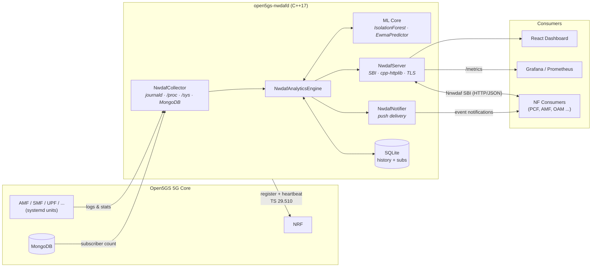

<div align="center">

# 🛰️ Open5GS NWDAF

### Production-grade Network Data Analytics Function for 5G Core — in modern C++

**Standalone NWDAF that plugs into [Open5GS](https://open5gs.org) and brings native ML-driven analytics to your 5G core — Release 18 compliant for the supported scope.** Both Nnwdaf services over HTTP/2 with the NF_LOAD, SLICE_LOAD_LEVEL, NSI_LOAD_LEVEL, NETWORK_PERFORMANCE and UE_MOBILITY analytics, the NRF lifecycle and discovery, mTLS and OAuth2; scope and evidence in [`docs/3gpp-rel18-compliance.md`](docs/3gpp-rel18-compliance.md).

[](https://github.com/cem8kaya/open5gs-nwdaf/actions/workflows/ci.yml)
[](LICENSE)
[](https://isocpp.org/)
[-green.svg)](docs/3gpp-rel18-compliance.md)
[](https://portal.3gpp.org/desktopmodules/Specifications/SpecificationDetails.aspx?specificationId=3579)
[](https://portal.3gpp.org/desktopmodules/Specifications/SpecificationDetails.aspx?specificationId=3355)
[](Dockerfile)
[](#-contributing)

[Quick Start](#-quick-start) · [Architecture](#-architecture) · [3GPP Compliance](#-3gpp-compliance) · [REST API](#-rest-api-ts-29520-sbi) · [Dashboard](#-dashboard--observability) · [Roadmap](#-roadmap) · [Contributing](#-contributing)

</div>

<!-- Add a dashboard screenshot at docs/assets/dashboard-overview.png and uncomment:

-->

---

## 💡 Why this project?

The **NWDAF (Network Data Analytics Function)** is the intelligence layer of the 5G Core defined by 3GPP — yet no complete, freely available open-source implementation exists that works out of the box with Open5GS. This project fills that gap:

- **Zero-friction Open5GS integration** — registers with the NRF, reads journald/`/proc`/`/sys`/MongoDB, no core patches required
- **Native, dependency-light ML** — Isolation Forest anomaly detection and EWMA prediction implemented in pure C++, no Python runtime, no TensorFlow
- **Standards-first:** the Rel-18 Nnwdaf services (TS 29.520) over HTTP/2, with requests validated against the official 3GPP OpenAPI files, and the TS 29.510 NRF lifecycle. It advertises only what it can truthfully serve; scope and evidence are in [`docs/3gpp-rel18-compliance.md`](docs/3gpp-rel18-compliance.md).
- **Ops-ready from day one** — Prometheus metrics, Grafana dashboard, React web UI, systemd unit, hardened Docker build, TLS/mTLS, rate limiting

## ✨ Features

| Capability | Details |
|---|---|
| 🛰️ **3GPP Rel-18 SBI** | Nnwdaf_AnalyticsInfo and Nnwdaf_EventsSubscription (TS 29.520) over HTTP/2 on port 7780. Requests are validated against the official 3GPP OpenAPI files, with supported-features negotiation and the spec's failure semantics. Serves **NF_LOAD**, **SLICE_LOAD_LEVEL**, **NSI_LOAD_LEVEL**, **NETWORK_PERFORMANCE** (`NUM_OF_UE`, `SESS_SUCC_RATIO`) and **UE_MOBILITY** (TA and cell per UE). NF_LOAD and NSI_LOAD_LEVEL are also predicted for a future period, with a confidence |
| 🔔 **Subscriptions** | Subscribe / modify / unsubscribe with PERIODIC, ONE_TIME and THRESHOLD / ON_EVENT_DETECTION reporting, immediate reports, and notifications over HTTP/2 |
| 📊 **Operator API** | 10 analytics on `/nwdaf-analytics/v1` for the dashboard and Prometheus: NF load, UE mobility, UE communication, abnormal behaviour, QoS sustainability, service experience, network performance, SM congestion, redundant transmission, dispersion |
| 🤖 **Embedded ML** | Native C++ Isolation Forest (anomaly detection), EWMA predictor (load forecasting) and ITU-T G.107 E-model (MOS). Atomic model persistence, retraining via the API |
| 📥 **Data collection** | No core patches: systemd unit states, journald, `/proc`, `/sys` throughput and MongoDB, plus each NF's Prometheus metrics (TS 28.552 measurements, per slice) as OAM input |
| 🧭 **NRF Integration** | TS 29.510 NFRegister, heartbeat with re-registration, NFDeregister, and NF instance IDs and NF status from the NRF. The NRF profile advertises only what the configuration supports |
| 🔐 **Security** | TLS and mutual TLS on both listeners, OAuth 2.0 access-token validation on the 3GPP interfaces (TS 33.501), NRF certificate verification, per-IP and global rate limiting, hardened build flags (`-D_FORTIFY_SOURCE=2`, PIE, RELRO) |
| 🗄️ **Persistence** | SQLite-backed throughput history and subscription store that survive restarts |
| 📈 **Observability** | Prometheus `/metrics`, Grafana dashboard JSON, readiness probe, and a `/health` that shows metric-scrape status and which Rel-18 analytics are advertised (with the missing configuration for the rest) |
| 🖥️ **Web Dashboard** | React + Recharts "NWDAF Intelligence" UI: live throughput, anomaly detection, MOS scores, traffic simulator, subscription management |
| 🧰 **Test tools** | `nwdaf-cli` (3GPP consumer), `nwdaf-notify-sink` (prints notifications), `nwdaf-fake-oam` (synthetic Open5GS metrics): exercise the 3GPP interfaces without a core or UEs |
| 🧪 **Tested** | 271 Catch2 test cases: unit, integration over HTTP/2, official-schema conformance, a mock Open5GS and a mock NRF. Checked live against Open5GS v2.8.0 with UERANSIM UEs ([`demo/`](demo/)) |
| 📦 **Deployable** | Two-stage Docker build (Ubuntu 22.04), systemd service, `cmake --install`; CI on Ubuntu 22.04 and 20.04 |

## 🏗 Architecture



**Data collection strategy** (Open5GS-specific, all configurable):

1. **NF health** — systemd unit states via the `nf_service_names` map (no fragile string-stripping)
2. **Throughput** — reads `/sys/class/net/<iface>/statistics/` directly, because the `gtp5g` kernel module bypasses user-space capture (tcpdump/eBPF)
3. **UE activity** — AMF/SMF journald parsing with a configurable `supi_regex` (`imsi-(\d{15})` for Open5GS ≥ v2.7.6)
4. **Subscriber count** — optional MongoDB (UDR/UDM database) integration

## 📐 3GPP Compliance

This table covers the **operator API** (`/nwdaf-analytics/v1/*`), where each ID
is served in this project's own format. On the 3GPP interfaces, `NF_LOAD`,
`SLICE_LOAD_LEVEL`, `NSI_LOAD_LEVEL`, `NETWORK_PERFORMANCE` and `UE_MOBILITY` are served in Rel-18 form; the others
are withheld until their inputs exist. The
per-ID reasons are in [`docs/3gpp-rel18-compliance.md`](docs/3gpp-rel18-compliance.md) §4.

| Analytics ID | TS 23.288 V18.13.0 | ML backing | Status |
|---|---|---|---|
| `NF_LOAD` | §6.5 | EWMA load prediction | ✅ Implemented |
| `UE_MOBILITY` | §6.7.2 | Journald registrations (operator API); TA and cell stays from the AMF's UE list on the 3GPP interfaces (I-12) | ✅ Implemented |
| `UE_COMMUNICATION` | §6.7.3 | — | ✅ Implemented |
| `ABNORMAL_BEHAVIOUR` | §6.7.5 | Isolation Forest | ✅ Implemented |
| `SERVICE_EXPERIENCE` | §6.4 | MOS estimation | ✅ Implemented |
| `NETWORK_PERFORMANCE` | §6.6 | Weighted composite score (operator API); `NUM_OF_UE` and `SESS_SUCC_RATIO` on the 3GPP interfaces (I-11) | ✅ Implemented |
| `QOS_SUSTAINABILITY` | §6.9 | Threshold trend analysis | ✅ Implemented |
| `SM_CONGESTION` | §6.12 | Failure-ratio + NF-load bands | ✅ Implemented |
| `RED_TRANS_EXP` | §6.13 | Rate-stability estimator | ✅ Implemented |
| `DISPERSION` | §6.10 | Gini / HHI concentration | ✅ Implemented |
| `DN_PERFORMANCE` | §6.14 | — | ⬜ Planned (needs `Naf_EventExposure`) |
| `SLICE_LOAD_LEVEL`, `NSI_LOAD_LEVEL` | §6.3 | NSAC-style occupancy (I-9) | 3GPP interfaces only, for configured `slice_capacity` (H1.2) |
| `USER_DATA_CONGESTION` | §6.8 | — | ⬜ Planned (needs per-location input) |
| `WLAN_PERFORMANCE` | §6.11 | — | ⬜ Planned (N3IWF-dependent) |

**Known scope limits.** `SM_CONGESTION`, `RED_TRANS_EXP` and
`DISPERSION` each report what the current journald/procfs data path can
actually observe and name the input they cannot yet see in a `note` field —
per-path GTP-U counters, per-location cell data, and per-slice decomposition
respectively. See [`docs/ENHANCEMENT_PLAN_5G_6G.md`](docs/ENHANCEMENT_PLAN_5G_6G.md)
H1.1–H1.3 for the work that lifts those limits.

IDs are spelled as in the Rel-18 `NwdafEvent` enum. The operator API still accepts the legacy spellings `QoS_SUSTAINABILITY` and `REDUNDANT_TRANSMISSION` on input.

**Release 18.** The frozen Rel-18 baseline is [`docs/frozen-standards.md`](docs/frozen-standards.md), and the gap analysis is [`docs/3gpp-rel18-compliance.md`](docs/3gpp-rel18-compliance.md). Milestone **M1 passed** (2026-09-28): the NWDAF is **Release 18 compliant for the supported scope**, in builds with the `rel18-sbi` profile (HTTP/2 + TLS). The Rel-18 3GPP interfaces serve **NF_LOAD**, **SLICE_LOAD_LEVEL** and **NSI_LOAD_LEVEL** for slices with a configured capacity (load level per interpretation I-9), **NETWORK_PERFORMANCE** (`NUM_OF_UE` for any area of TAs or cells with the AMF's UE list, `SESS_SUCC_RATIO` for the configured served area; I-11), and **UE_MOBILITY** for SUPIs, from the AMF's per-UE list (I-12). NF_LOAD and NSI_LOAD_LEVEL are also predicted for a future analytics target period within the prediction horizon, with a confidence (I-13). The other analytics listed above are served on the operator API; their Rel-18 forms are not yet advertised, because they need inputs the scraped data path lacks. Open5GS v2.8.0 exposes no NF event-exposure services and no OAuth 2.0 (see the compliance doc).

### OpenAPI contract

The SBI *as currently served* is published as an OpenAPI 3.0 document at
[`docs/openapi/nwdaf-analytics-v1.yaml`](docs/openapi/nwdaf-analytics-v1.yaml),
and served from the running instance at `GET /nwdaf-analytics/v1/openapi` so NF
consumers can fetch the contract without cloning the repository:

```bash
curl "http://127.0.0.1:7779/nwdaf-analytics/v1/openapi" -o nwdaf-openapi.yaml
```

It is not documentation-by-hand: `tests/test_openapi_conformance.cpp` loads it
and validates live responses from every endpoint against the declared schemas,
so the spec and the implementation cannot drift apart without CI failing.

This document describes this project's own API. It is validated against
itself, not against the official 3GPP Rel-18 artifacts. Official-schema
conformance is roadmap item H1.6 (extended) / H1.7.

## 🚀 Quick Start

**Live demo.** [`demo/`](demo/README.md) runs an Open5GS v2.8.0 core, UERANSIM
UEs and this NWDAF in one container. `demo/run.sh` starts it; then
`docker exec -it nwdaf-demo nwdaf-demo` walks through registrations, UE
traffic, the Rel-18 analytics and a subscription.

> **Verified on CI:** Ubuntu 22.04 (full: sd-journal + TLS + SQLite) and Ubuntu 20.04 (sd-journal + SQLite, TLS off) — see the [CI workflow](.github/workflows/ci.yml).

### Prerequisites

**Toolchain (required):**

```bash
sudo apt-get update
sudo apt-get install -y --no-install-recommends \
    build-essential cmake git pkg-config ca-certificates
```

- **CMake ≥ 3.22** is required. Ubuntu 22.04 satisfies this; **Ubuntu 20.04 ships CMake 3.16**, so install a newer one there (e.g. `pip3 install "cmake>=3.22,<4"` or the [Kitware APT repo](https://apt.kitware.com/)).
- An **internet connection is needed on the first configure**: cpp-httplib, nlohmann/json, yaml-cpp, spdlog (and Catch2 for tests) are fetched automatically via CMake `FetchContent`. You do **not** need to install these from apt.

**Optional feature dependencies** (each degrades gracefully if absent):

```bash
sudo apt-get install -y --no-install-recommends \
    libsystemd-dev \    # journald collection      (NWDAF_USE_SD_JOURNAL=ON)
    libssl-dev \        # TLS on the SBI            (NWDAF_USE_TLS=ON, needs OpenSSL ≥ 3.0)
    libsqlite3-dev \    # restart-safe persistence  (history_backend=sqlite)
    libnghttp2-dev libcurl4-openssl-dev \   # HTTP/2 SBI (NWDAF_USE_HTTP2=ON; needed to register with an Open5GS NRF)
    libmongoc-dev libmongocxx-dev   # subscriber count via MongoDB
```

> **TLS needs OpenSSL ≥ 3.0** (Ubuntu 22.04+). On Ubuntu 20.04 (OpenSSL 1.1.1), build with `-DNWDAF_USE_TLS=OFF`.

### Build

**Ubuntu 22.04+ (full features):**

```bash
cmake -S . -B build -DCMAKE_BUILD_TYPE=Release
cmake --build build --parallel $(nproc)
```

**Ubuntu 20.04 (TLS off — OpenSSL 1.1.1):**

```bash
cmake -S . -B build -DCMAKE_BUILD_TYPE=Release -DNWDAF_USE_TLS=OFF
cmake --build build --parallel $(nproc)
```

**Minimal build** (no journald, no TLS — e.g. non-systemd hosts or containers):

```bash
cmake -S . -B build \
    -DNWDAF_USE_SD_JOURNAL=OFF \
    -DNWDAF_USE_TLS=OFF
cmake --build build --parallel $(nproc)
```

### Run

```bash
./build/open5gs-nwdafd --config config/nwdaf.yaml
curl http://127.0.0.1:7779/nwdaf-analytics/v1/health
```

### Run tests

```bash
cd build && ctest --output-on-failure
```

### Docker

The image is a multi-stage build on `ubuntu:22.04` (OpenSSL 3.0, so TLS-capable) and contains only the daemon binary and default config.

```bash
docker build -t open5gs-nwdaf .
docker run --rm -p 7779:7779 open5gs-nwdaf
```

> To reach the SBI from outside the container, set `sbi_bind_address: "0.0.0.0"` in your config — the default `127.0.0.1` only listens inside the container. Mount your own config with `-v $(pwd)/config/nwdaf.yaml:/etc/open5gs/nwdaf.yaml`.

### Install as a systemd service

```bash
sudo cmake --install build
sudo systemctl daemon-reload
sudo systemctl enable --now open5gs-nwdafd
```

## 🔌 REST API (TS 29.520 SBI)

Base URL: `http://<host>:7779`

| Method | Path | Description |
|--------|------|-------------|
| `GET` | `/nwdaf-analytics/v1/health` | Liveness probe (returns `UP` immediately). Also reports the transport profile, the metrics endpoints' scrape status (`oamSources`), and which Rel-18 analytics are advertised, with the missing configuration for the rest (`rel18Analytics`). |
| `GET` | `/nwdaf-analytics/v1/ready` | Readiness probe (`READY` once ML models are fitted, `503` otherwise) |
| `GET` | `/nwdaf-analytics/v1/metrics` | Prometheus metrics |
| `GET` | `/nwdaf-analytics/v1/openapi` | The published OpenAPI 3.0 contract (`application/yaml`) |
| `GET` | `/nwdaf-analytics/v1/analytics?analyticsId=<ID>` | Fetch analytics (`Nnwdaf_AnalyticsInfo`) |
| `POST` | `/nnwdaf-analyticsinfo/v1/analytics` | Analytics request with a JSON body (DNN / S-NSSAI filters). **Non-standard:** TS 29.520 defines this operation as a `GET` with query parameters (roadmap H1.7). |
| `POST` | `/nwdaf-analytics/v1/subscriptions` | Create subscription (`Nnwdaf_EventsSubscription`) |
| `GET` | `/nwdaf-analytics/v1/subscriptions` | List subscriptions |
| `GET` | `/nwdaf-analytics/v1/subscriptions/{subId}` | Get subscription |
| `DELETE` | `/nwdaf-analytics/v1/subscriptions/{subId}` | Delete subscription |
| `POST` | `/nwdaf-analytics/v1/train` | Retrain the Isolation Forest on collected history |

**3GPP Rel-18 interfaces** (TS 29.520 V18.14.0; requests validated against the official OpenAPI; see [`docs/3gpp-rel18-compliance.md`](docs/3gpp-rel18-compliance.md)):

| Method | Path | Description |
|--------|------|-------------|
| `GET` | `/nnwdaf-analyticsinfo/v1/analytics?event-id=…&tgt-ue=…` | `Nnwdaf_AnalyticsInfo`. `NF_LOAD`, when `nf_instance_ids` or `nrf_nf_discovery` is configured; `LOAD_LEVEL_INFORMATION` (slice load level) and `NSI_LOAD_LEVEL`, when `slice_capacity` is configured; `NETWORK_PERFORMANCE`, when `amf_ue_info_endpoint`, or `served_tai_list` with a metrics endpoint, is configured; `UE_MOBILITY`, when `amf_ue_info_endpoint` is configured. |
| `POST` | `/nnwdaf-eventssubscription/v1/subscriptions` | `Nnwdaf_EventsSubscription` Subscribe. Returns `201` + `Location`. Reporting: PERIODIC, ONE_TIME, and THRESHOLD / ON_EVENT_DETECTION on `nfLoadLvlThds` (CPU), `loadLevelThreshold`, `nsiLevelThrds` and `nwPerfRequs` (interpretation I-10). |
| `PUT` / `DELETE` | `/nnwdaf-eventssubscription/v1/subscriptions/{subscriptionId}` | Modify / Unsubscribe |

These are served over **HTTP/2** on `sbi_h2_port` (default 7780): h2c with prior knowledge, or h2 over TLS. For example, `curl --http2-prior-knowledge "http://127.0.0.1:7780/nnwdaf-analyticsinfo/v1/analytics?event-id=NF_LOAD&tgt-ue=%7B%22anyUe%22%3Atrue%7D"`. Notifications are `NnwdafEventsSubscriptionNotification` bodies, sent over HTTP/2 with `3gpp-Sbi-Callback: Nnwdaf_EventsSubscription_Notify`. [`tools/nwdaf-cli`](#-test-tools) builds these queries for you.

### Examples

```bash
# NF load analytics
curl "http://127.0.0.1:7779/nwdaf-analytics/v1/analytics?analyticsId=NF_LOAD"

# Anomaly detection
curl "http://127.0.0.1:7779/nwdaf-analytics/v1/analytics?analyticsId=ABNORMAL_BEHAVIOUR"

# Session-management congestion (TS 23.288 §6.12)
curl "http://127.0.0.1:7779/nwdaf-analytics/v1/analytics?analyticsId=SM_CONGESTION"

# Service experience — MOS with its G.107 impairment breakdown
curl "http://127.0.0.1:7779/nwdaf-analytics/v1/analytics?analyticsId=SERVICE_EXPERIENCE"

# Subscribe to events with push notifications
curl -X POST "http://127.0.0.1:7779/nwdaf-analytics/v1/subscriptions" \
  -H "Content-Type: application/json" \
  -d '{"eventId": "NF_LOAD", "notificationUri": "http://consumer:8080/notify"}'
```

### 🧰 Test tools

The tools in [`tools/`](tools/) exercise the 3GPP interfaces without a consumer NF, UEs or a core. The quickest start is one command from the repository root, after a build:

```bash
tools/nwdaf-local            # fake Open5GS data + notify sink + the NWDAF (config/nwdaf-local.yaml); Ctrl-C stops all
tools/nwdaf-local --check    # the same, with smoke checks through nwdaf-cli (also run in CI)
```

`cmake --install` puts the three tools below in `/usr/local/bin`.

| Tool | What it does |
|---|---|
| `nwdaf-cli` | Nnwdaf_AnalyticsInfo and Nnwdaf_EventsSubscription from short options. It builds the JSON-encoded query parameters and subscription bodies and sends them over h2c. `nwdaf-cli health` shows what is advertised and why the rest isn't. Needs `curl` and `jq`. |
| `nwdaf-notify-sink` | A notification consumer. It listens over h2c (Rel-18 notifications) and optionally HTTP/1.1 (`--http1-port`, operator-API ones), prints each notification and answers `204`. Built with `NWDAF_USE_HTTP2`. |
| `nwdaf-fake-oam` | Synthetic Open5GS v2.8.0 AMF and SMF metrics (registered UEs and PDU sessions per slice, session setup counters) and the AMF's per-UE list (`/ue-info`, UEs moving between `--area` locations every `--move` seconds), changed at runtime with `curl '…/set?ues=8'`. Python 3, no packages. |

```bash
nwdaf-fake-oam --ues 4 --req-rate 2 --fail-ratio 0.25 &   # oam_metrics_endpoints: AMF …:9090/amf/metrics, SMF …:9090/smf/metrics
nwdaf-notify-sink --port 9999 &

nwdaf-cli health
nwdaf-cli get NETWORK_PERFORMANCE --nw-perf NUM_OF_UE --nw-perf SESS_SUCC_RATIO --tai 999-70-1
nwdaf-cli get SLICE_LOAD_LEVEL --any-slice
nwdaf-cli subscribe SLICE_LOAD_LEVEL --snssai 1 --threshold 60 --notify http://127.0.0.1:9999/n
curl 'http://127.0.0.1:9090/set?ues=9'                    # the sink prints the threshold report
nwdaf-cli unsubscribe sub-…
```

`nwdaf-cli --help` lists every option. `-v` shows the encoded request.

## ⚙️ Configuration

Everything deployment-specific lives in [`config/nwdaf.yaml`](config/nwdaf.yaml).

**Reloading.** `systemctl reload open5gs-nwdafd` (SIGHUP) applies, without a restart: `log_level`, `collection_interval_seconds`, `ewma_alpha`, `anomaly_contamination`, the data sources (`oam_metrics_endpoints`, `amf_ue_info_endpoint`), the capability settings (`slice_capacity`, `served_tai_list`, `nf_instance_ids`), the analytics windows and the `prediction_*` settings. When the advertised analytics or served TAIs change, the NWDAF sends the new profile to the NRF (NFUpdate) and logs the advertisement before and after. A file that fails to validate is refused and the running configuration kept. Every other setting needs a restart.

| Parameter | Default | Description |
|---|---|---|
| `nf_instance_id` | — | **Mandatory.** Stable UUID of this NF instance |
| `plmn_mcc` / `plmn_mnc` | `999` / `70` | PLMN (test network default) |
| `sbi_bind_address` / `sbi_port` | `127.0.0.1` / `7779` | Operator API and dashboard, over HTTP/1.1. Must not collide with Open5GS's 7777. |
| `sbi_h2_port` | `7780` | The 3GPP interfaces over HTTP/2 (TS 29.500 §5.2). This is the endpoint registered with the NRF. `0` disables it. |
| `nf_service_names` | `AMF→amfd`, … | Open5GS systemd unit suffix map |
| `nf_instance_ids` | — | NF type → the NF's real `nfInstanceId`, for Rel-18 NF_LOAD on the 3GPP interfaces. Takes precedence over discovery. |
| `nrf_nf_discovery` / `nrf_nf_discovery_interval_seconds` | `false` / `60` | Poll the NRF (NFListRetrieval and NFProfileRetrieval) every interval. This resolves the remaining NF instance IDs (a type is used only when exactly one instance is registered) and records each NF's NRF status for NF_LOAD `nfStatus`. NF_LOAD is advertised when this is on or `nf_instance_ids` is set. NFDiscover is not used: Open5GS NFs don't allow the NWDAF NF type, so the NRF hides them from it. |
| `nrf_nf_status_window_seconds` | `3600` | Window over which NF_LOAD `nfStatus` is computed: the share of NRF polls that found each instance registered, undiscoverable or absent. |
| `throughput_interfaces` | `ogstun` | UPF tunnel interfaces to sample |
| `oam_metrics_endpoints` | _(empty)_ | NF type → Prometheus metrics URL of that NF, scraped every collection interval as OAM input (TS 28.552 measurement names, such as per-slice registered UEs and PDU sessions). The Open5GS v2.8.0 defaults are AMF `http://127.0.0.5:9090/metrics`, SMF `…127.0.0.4…`, UPF `…127.0.0.7…` and PCF `…127.0.0.13…`. Scrape status appears under `oamSources` in `/health`. |
| `slice_capacity` | _(empty)_ | Per S-NSSAI admission capacity: `snssai` (`sst`, optional `sd`) with `max_ues` and/or `max_pdu_sessions`, as an NSACF would be configured. SLICE_LOAD_LEVEL and NSI_LOAD_LEVEL are served and advertised only for these slices. The load level is the higher of the UE and PDU-session occupancy in percent (interpretation I-9). `max_ues` needs `oam_metrics_endpoints.AMF`, `max_pdu_sessions` needs `.SMF`. |
| `served_tai_list` | _(empty)_ | The tracking areas the core serves (`mcc`, `mnc` default to `plmn_mcc`/`plmn_mnc`; `tac` as an unquoted decimal number, as in Open5GS `amf.yaml`, or quoted 4 or 6 hex digits such as `"0003e8"`). Needed by NETWORK_PERFORMANCE from the metrics: Open5GS counts are per AMF and SMF, so those requests must cover this whole area (I-11). With `amf_ue_info_endpoint`, `NUM_OF_UE` is answered for any area of TAs or cells instead. |
| `network_performance_window_seconds` | `300` | Period of the NETWORK_PERFORMANCE statistics when the consumer gives no `startTs`/`endTs`. |
| `amf_ue_info_endpoint` | _(empty)_ | The AMF's per-UE list, polled every collection interval for UE locations (Open5GS v2.8.0: `http://127.0.0.5:9090/ue-info`, on its metrics server). UE_MOBILITY is served and advertised only when set (I-12). The list carries SUPIs and is served without authentication, so keep the metrics port internal. |
| `ue_mobility_window_seconds` | `3600` | Period of the UE_MOBILITY statistics when the consumer gives no `startTs`/`endTs`. |
| `ue_location_history_seconds` | `86400` | How long UE locations are kept, in memory only. |
| `prediction_horizon_seconds` | `900` | How far ahead a predicted period (a future `startTs`/`endTs`) may end, for NF_LOAD and NSI_LOAD_LEVEL (I-13). `0` turns predictions off. |
| `prediction_min_samples` | `10` | Fewer samples than this give a prediction with confidence 0, as TS 29.520 requires when data is insufficient. |
| `prediction_tolerance` | `10` | The error, in percentage points, still counted as a correct prediction: the confidence is the probability of staying within it. |
| `slice_load_window_seconds` | `300` | Period of the slice load statistics when the consumer gives no `startTs`/`endTs`: the last N seconds. |
| `collection_interval_seconds` | `10` | Collector cadence |
| `supi_regex` | `imsi-(\d{15})` | SUPI extraction pattern (Open5GS v2.7.6) |
| `mongodb_uri` / `mongodb_db` | `127.0.0.1:27017` / `open5gs` | Optional subscriber-count source |
| `nrf_uri` | `http://127.0.0.10:7777` | NRF for registration + heartbeat |
| `nrf_heartbeat_interval_seconds` | `60` | TS 29.510 heartbeat (`0` = disabled) |
| `anomaly_contamination` | `0.10` | Expected anomaly fraction (Isolation Forest) |
| `anomaly_seed` | `0` | Deterministic ML seed (`0` = random) |
| `anomaly_min_samples` | `120` | Retrain quality gate (~20 min at 10 s interval) |
| `baseline_stddev_min_kbps` | `0.5` | Idle-baseline guard against zero-traffic false positives |
| `ewma_alpha` | `0.3` | EWMA smoothing factor |
| `history_backend` / `history_db_path` | `sqlite` | Restart-safe history + subscription persistence |
| `rate_limit_per_ip_rps` / `rate_limit_global_rps` | `10` / `100` | Token-bucket SBI rate limits (`0` = off) |
| `network_performance_weights` | `0.6/0.2/0.2` | NF-health / DL / PDU weights (validated to sum to 1.0) |
| `openapi_spec_path` | `/etc/open5gs/openapi/nwdaf-analytics-v1.yaml` | The operator-API contract served at `GET /nwdaf-analytics/v1/openapi` (404 when missing). |
| `openapi_3gpp_dir` | `/etc/open5gs/openapi/3gpp` | The official 3GPP OpenAPI files the 3GPP interfaces validate requests against (`cmake --install` puts them here). When they can't be loaded, the 3GPP interfaces answer `500 SYSTEM_FAILURE` and the log says so; point this at another copy, such as `build/3gpp-openapi`, when running from a build. |
| `oauth_enabled` + `oauth_nrf_public_key_file` / `oauth_shared_secret_file` | `false` | OAuth 2.0 access tokens on the 3GPP interfaces (TS 33.501 §13.4.1): signature, claims, scope and expiry are validated. The key is the NRF's public key (RS256/ES256) or a shared secret (HS256). **Keep it off with Open5GS**, which does not issue or send tokens. Needs a TLS build. |
| `tls_enabled` + cert/key/CA paths | `false` | TLS on the SBI. Setting `tls_ca_file` enables mutual TLS: clients must present a certificate signed by that CA, and an unreadable CA stops startup. The NRF client verifies the NRF against the same CA, or against the system trust store if none is set. |

### Build options

| CMake option | Default | Description |
|---|---|---|
| `NWDAF_USE_SD_JOURNAL` | `ON` | journald collection via libsystemd |
| `NWDAF_USE_TLS` | `ON` | TLS on SBI (OpenSSL) |
| `NWDAF_USE_HTTP2` | `ON` | HTTP/2 for the 3GPP interfaces and the NRF (nghttp2, libcurl). `OFF` gives the `dev-legacy` profile, which is HTTP/1.1 only and transport non-compliant; the Open5GS NRF also rejects HTTP/1.1. |
| `NWDAF_REQUIRE_REL18_PROFILE` | `OFF` | Fail the configure unless HTTP/2 and TLS are both enabled |
| `NWDAF_ENABLE_PUSH_DELIVERY` | `ON` | Subscription push-notification thread |
| `NWDAF_BUILD_TESTS` | `ON` | Catch2 unit + integration tests |

Optional dependencies degrade gracefully: no MongoDB driver → subscriber count returns 0; no SQLite → in-memory history only.

> **TLS note:** `NWDAF_USE_TLS=ON` requires **OpenSSL ≥ 3.0** (Ubuntu 22.04+). On Ubuntu 20.04 (OpenSSL 1.1.1), build with `-DNWDAF_USE_TLS=OFF`; sd-journal and SQLite are unaffected.

## 📊 Dashboard & Observability

- **NWDAF Intelligence web UI** ([`dashboard/`](dashboard/)) — React + Recharts single-page app with live throughput, NF health, anomaly detection, QoS sustainability, MOS/service experience, network performance scoring, subscription management, a traffic simulator, and light/dark themes.
- **Grafana** ([`grafana/nwdaf_dashboard.json`](grafana/nwdaf_dashboard.json)) — import-ready dashboard fed by the Prometheus `/metrics` endpoint.

## 🧠 ML Internals

| Model | Purpose | Implementation |
|---|---|---|
| **Isolation Forest** | `ABNORMAL_BEHAVIOUR` — flags throughput/behaviour outliers | Native C++ (~300 LoC), configurable contamination & seed, quality-gated retraining, atomic write-then-rename model persistence |
| **EWMA Predictor** | `NF_LOAD` — short-horizon load forecasting | Exponentially weighted moving average with configurable α |
| **E-model MOS estimator** | `SERVICE_EXPERIENCE` — mean opinion score | ITU-T G.107 transmission rating: `R = R0 − Id − Ie_eff`, with a Weber-Fechner throughput term, G.107 packet-loss weighting and the `Idd` delay curve. Reports the R-factor and a per-impairment breakdown; falls back to the legacy step ladder when no throughput sample is available |

No Python runtime, no external ML framework — the entire inference path is in-process C++, which keeps the footprint small enough for edge and lab deployments.

## 🧪 Testing

271 Catch2 test cases across 18 suites, including a **mock Open5GS environment** so the full pipeline can be tested without a running core. The main ones:

```bash
cmake -S . -B build -DNWDAF_BUILD_TESTS=ON
cmake --build build --parallel
cd build && ctest --output-on-failure
```

| Suite | Covers |
|---|---|
| `test_collector` | Data collection, parsing, interface stats |
| `test_analytics` | The original 7 analytics IDs, ML outputs, edge cases |
| `test_h1_analytics` | E-model MOS calibration and the `SM_CONGESTION` / `RED_TRANS_EXP` / `DISPERSION` analytics |
| `test_server_integration` | SBI endpoints, subscriptions, auth, rate limiting |
| `test_arch_improvements` | Persistence, TLS config, weights validation |
| `test_openapi_conformance` | Every endpoint validated against the published OpenAPI schemas |
| `test_3gpp_sbi` | The Rel-18 Nnwdaf interfaces over HTTP/2: requests, failure semantics, subscriptions, notifications |
| `test_slice_load`, `test_network_performance`, `test_threshold_reporting` | SLICE_LOAD_LEVEL / NSI_LOAD_LEVEL (I-9), NETWORK_PERFORMANCE (I-11), THRESHOLD reporting (I-10), against the official schemas |
| `test_nrf_client`, `test_sbi_security`, `test_oauth` | NRF lifecycle against a mock NRF, mTLS, OAuth 2.0 token validation |

## 🗺 Roadmap

Tracked against [`docs/ENHANCEMENT_PLAN_5G_6G.md`](docs/ENHANCEMENT_PLAN_5G_6G.md)
and the [5G/6G enhancement plan project board](https://github.com/users/cem8kaya/projects/5).

**Horizon 1 — Rel-17/18 completeness & data-path realism** ([#20](https://github.com/cem8kaya/open5gs-nwdaf/issues/20))

- [x] `DISPERSION`, `SM_CONGESTION`, `RED_TRANS_EXP` analytics ([#26](https://github.com/cem8kaya/open5gs-nwdaf/issues/26), partial)
- [x] MOS / service-experience E-model upgrade ([#27](https://github.com/cem8kaya/open5gs-nwdaf/issues/27))
- [x] OpenAPI 3.0 spec published + CI conformance test ([#28](https://github.com/cem8kaya/open5gs-nwdaf/issues/28))
- [x] H1.7 — 3GPP Nnwdaf SBI conformance (Rel-18 resources, data types, failure semantics, supported features, PERIODIC / ONE_TIME / THRESHOLD reporting; NF_LOAD, SLICE_LOAD_LEVEL, NSI_LOAD_LEVEL)
- [x] H1.8 — HTTP/2 SBI transport + compliance profile
- [x] H1.9 — Truthful Rel-18 NRF profile, lifecycle, and NF instance IDs / NF status from the NRF
- [x] H1.10 — SBI security: mTLS, OAuth2 access-token validation, NRF client TLS
- [x] **M1 — Rel-18 supported-scope compliance gate** (passed 2026-09-28). See [`docs/3gpp-rel18-compliance.md`](docs/3gpp-rel18-compliance.md)
- [ ] Pluggable `IDataSource` ingestion — SBI / OAM backend ([#23](https://github.com/cem8kaya/open5gs-nwdaf/issues/23); partial: OAM input from the NFs' metrics endpoints)
- [ ] Slice awareness (S-NSSAI) + `SLICE_LOAD_LEVEL` (TS 23.288 §6.3) ([#24](https://github.com/cem8kaya/open5gs-nwdaf/issues/24); partial: SLICE_LOAD_LEVEL / NSI_LOAD_LEVEL served, per-slice anomaly models open)
- [ ] PFCP usage reporting → per-UE / per-session analytics ([#25](https://github.com/cem8kaya/open5gs-nwdaf/issues/25); on hold, see the enhancement plan)
- [ ] `DN_PERFORMANCE` (§6.14) and `USER_DATA_CONGESTION` (§6.8) — both blocked on the above input paths

**Horizon 2 — Data & ML platform maturity** ([#21](https://github.com/cem8kaya/open5gs-nwdaf/issues/21))

- [ ] MTLF / AnLF split (Rel-17 §5.1) ([#29](https://github.com/cem8kaya/open5gs-nwdaf/issues/29))
- [ ] Model registry, versioning and rollback ([#30](https://github.com/cem8kaya/open5gs-nwdaf/issues/30))
- [ ] Drift detection + auto-retrain ([#31](https://github.com/cem8kaya/open5gs-nwdaf/issues/31))
- [ ] Seasonality-aware forecasting — Holt-Winters / ONNX ([#32](https://github.com/cem8kaya/open5gs-nwdaf/issues/32))
- [ ] ADRF + data lake / feature store, Parquet export ([#33](https://github.com/cem8kaya/open5gs-nwdaf/issues/33))
- [ ] Evaluation harness + calibrated confidence ([#34](https://github.com/cem8kaya/open5gs-nwdaf/issues/34))
- [ ] Per-feature anomaly attribution ([#35](https://github.com/cem8kaya/open5gs-nwdaf/issues/35))

**Horizon 3 — 5G-Advanced → 6G readiness** ([#22](https://github.com/cem8kaya/open5gs-nwdaf/issues/22))

- [ ] Closed-loop automation & intent layer ([#36](https://github.com/cem8kaya/open5gs-nwdaf/issues/36))
- [ ] Energy efficiency & sustainability analytics ([#37](https://github.com/cem8kaya/open5gs-nwdaf/issues/37))
- [ ] AI-native / federated learning coordinator ([#38](https://github.com/cem8kaya/open5gs-nwdaf/issues/38))
- [ ] Network digital twin ([#39](https://github.com/cem8kaya/open5gs-nwdaf/issues/39))
- [ ] ISAC data types ([#40](https://github.com/cem8kaya/open5gs-nwdaf/issues/40))
- [ ] Kubernetes Helm chart + horizontal scaling ([#41](https://github.com/cem8kaya/open5gs-nwdaf/issues/41))

**Unscheduled**

- [ ] srsRAN / UERANSIM end-to-end CI pipeline

## 🤝 Contributing

Contributions are very welcome — this project aims to become the reference open-source NWDAF for the Open5GS ecosystem.

1. Fork the repo and create a feature branch
2. Build with tests: `cmake -S . -B build -DNWDAF_BUILD_TESTS=ON`
3. Make sure `ctest` passes and the build stays warning-clean (`-Wall -Wextra -Werror`)
4. Open a PR with a clear description; reference the relevant 3GPP clause when touching spec-defined behaviour

Bug reports, spec-compliance findings, and lab test reports (please include your Open5GS version and topology) are as valuable as code.

## 📄 License

Licensed under the [Apache License 2.0](LICENSE) — free for commercial and non-commercial use.

## 🙏 Acknowledgements

- [Open5GS](https://github.com/open5gs/open5gs) — the open-source 5G core this project is built to serve
- [cpp-httplib](https://github.com/yhirose/cpp-httplib), [nlohmann/json](https://github.com/nlohmann/json), [yaml-cpp](https://github.com/jbeder/yaml-cpp), [spdlog](https://github.com/gabime/spdlog), [Catch2](https://github.com/catchorg/Catch2)
- 3GPP SA2/CT3 for the NWDAF specification family

---

<div align="center">

**⭐ If this project is useful to you, please star it — it directly helps the 5G open-source ecosystem grow.**

[Report a bug](https://github.com/cem8kaya/open5gs-nwdaf/issues) · [Request a feature](https://github.com/cem8kaya/open5gs-nwdaf/issues) · [Discussions](https://github.com/cem8kaya/open5gs-nwdaf/discussions)

</div>
