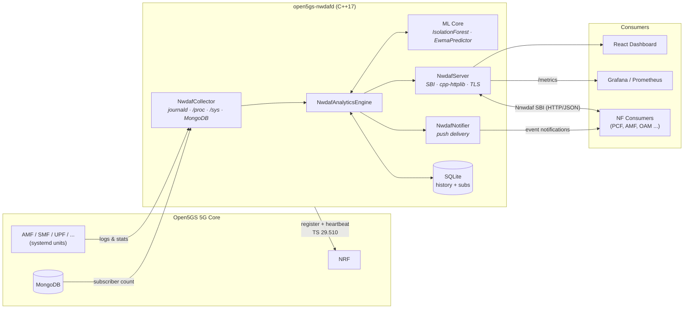

<div align="center">

# 🛰️ Open5GS NWDAF

### Production-grade Network Data Analytics Function for 5G Core — in modern C++

**Standalone, 3GPP Release-17-based NWDAF that plugs into [Open5GS](https://open5gs.org) and brings native ML-driven analytics to your 5G core. Release 18 compliance for the supported scope is in progress. Status: [`docs/3gpp-rel18-compliance.md`](docs/3gpp-rel18-compliance.md).**

[](https://github.com/cem8kaya/open5gs-nwdaf/actions/workflows/ci.yml)
[](LICENSE)
[](https://isocpp.org/)
[](https://www.3gpp.org/specifications-technologies/releases/release-17)
[](https://portal.3gpp.org/desktopmodules/Specifications/SpecificationDetails.aspx?specificationId=3579)
[](https://portal.3gpp.org/desktopmodules/Specifications/SpecificationDetails.aspx?specificationId=3355)
[](Dockerfile)
[](#-contributing)

[Quick Start](#-quick-start) · [Architecture](#-architecture) · [3GPP Compliance](#-3gpp-compliance) · [REST API](#-rest-api-ts-29520-sbi) · [Dashboard](#-dashboard--observability) · [Roadmap](#-roadmap) · [Contributing](#-contributing)

</div>

<!-- Add a dashboard screenshot at docs/assets/dashboard-overview.png and uncomment:

-->

---

## 💡 Why this project?

The **NWDAF (Network Data Analytics Function)** is the intelligence layer of the 5G Core defined by 3GPP — yet no complete, freely available open-source implementation exists that works out of the box with Open5GS. This project fills that gap:

- **Zero-friction Open5GS integration** — registers with the NRF, reads journald/`/proc`/`/sys`/MongoDB, no core patches required
- **Native, dependency-light ML** — Isolation Forest anomaly detection and EWMA prediction implemented in pure C++, no Python runtime, no TensorFlow
- **Spec-anchored design:** the analytics IDs follow TS 23.288, and NRF registration follows TS 29.510. The current SBI is a custom API modelled on TS 29.520. Moving it onto the standard Rel-18 resources, data types and HTTP/2 transport is tracked in [`docs/3gpp-rel18-compliance.md`](docs/3gpp-rel18-compliance.md).
- **Ops-ready from day one** — Prometheus metrics, Grafana dashboard, React web UI, systemd unit, hardened Docker build, TLS/mTLS, rate limiting

## ✨ Features

| Capability | Details |
|---|---|
| 📊 **10 Analytics IDs** | NF load, UE mobility, UE communication, abnormal behaviour, QoS sustainability, service experience, network performance, SM congestion, redundant transmission, dispersion |
| 🤖 **Embedded ML** | Native C++ Isolation Forest (anomaly detection) + EWMA predictor (load forecasting), atomic model persistence, on-demand retraining via API |
| 🔔 **Subscriptions** | `Nnwdaf_EventsSubscription` create/list/get/delete with push notification delivery (background notifier thread) |
| 🗄️ **Persistence** | SQLite-backed throughput history and subscription store — survives restarts |
| 🛰️ **NRF Integration** | Registration + heartbeat per TS 29.510 §5.3.2.4 |
| 🔐 **Security** | TLS on the SBI with opt-in mutual TLS (`tls_ca_file`), per-IP + global token-bucket rate limiting, hardened build flags (`-D_FORTIFY_SOURCE=2`, PIE, RELRO). OAuth 2.0 access-token validation on the 3GPP interfaces (`oauth_enabled`). |
| 📈 **Observability** | Prometheus `/metrics`, Grafana dashboard JSON, health/readiness probes |
| 🖥️ **Web Dashboard** | React + Recharts "NWDAF Intelligence" UI: live throughput, anomaly detection, MOS scores, traffic simulator, subscription management |
| 🧪 **Tested** | 85 Catch2 test cases: unit, integration, and a mock Open5GS environment |
| 📦 **Deployable** | Reproducible two-stage Docker build (Ubuntu 22.04, pinned deps), systemd service, `cmake --install` |

## 🏗 Architecture



**Data collection strategy** (Open5GS-specific, all configurable):

1. **NF health** — systemd unit states via the `nf_service_names` map (no fragile string-stripping)
2. **Throughput** — reads `/sys/class/net/<iface>/statistics/` directly, because the `gtp5g` kernel module bypasses user-space capture (tcpdump/eBPF)
3. **UE activity** — AMF/SMF journald parsing with a configurable `supi_regex` (`imsi-(\d{15})` for Open5GS ≥ v2.7.6)
4. **Subscriber count** — optional MongoDB (UDR/UDM database) integration

## 📐 3GPP Compliance

| Analytics ID | TS 23.288 (Rel-17) | ML backing | Status |
|---|---|---|---|
| `NF_LOAD` | §6.5 | EWMA load prediction | ✅ Implemented |
| `UE_MOBILITY` | §6.7.2 | — | ✅ Implemented |
| `UE_COMMUNICATION` | §6.7.3 | — | ✅ Implemented |
| `ABNORMAL_BEHAVIOUR` | §6.7.5 | Isolation Forest | ✅ Implemented |
| `SERVICE_EXPERIENCE` | §6.4 | MOS estimation | ✅ Implemented |
| `NETWORK_PERFORMANCE` | §6.6 | Weighted composite score | ✅ Implemented |
| `QOS_SUSTAINABILITY` | §6.9 | Threshold trend analysis | ✅ Implemented |
| `SM_CONGESTION` | §6.16 | Failure-ratio + NF-load bands | ✅ Implemented |
| `RED_TRANS_EXP` | §6.12 | Rate-stability estimator | ✅ Implemented |
| `DISPERSION` | §6.10 | Gini / HHI concentration | ✅ Implemented |
| `DN_PERFORMANCE` | §6.14 | — | ⬜ Planned (needs `Naf_EventExposure`) |
| `SLICE_LOAD_LEVEL` | §6.3 | — | ⬜ Planned (needs S-NSSAI threading) |
| `USER_DATA_CONGESTION` | §6.8 | — | ⬜ Planned (needs per-location input) |
| `WLAN_PERFORMANCE` | §6.11 | — | ⬜ Planned (N3IWF-dependent) |

**Known scope limits.** `SM_CONGESTION`, `RED_TRANS_EXP` and
`DISPERSION` each report what the current journald/procfs data path can
actually observe and name the input they cannot yet see in a `note` field —
per-path GTP-U counters, per-location cell data, and per-slice decomposition
respectively. See [`docs/ENHANCEMENT_PLAN_5G_6G.md`](docs/ENHANCEMENT_PLAN_5G_6G.md)
H1.1–H1.3 for the work that lifts those limits.

IDs are spelled as in the Rel-18 `NwdafEvent` enum. The operator API still accepts the legacy spellings `QoS_SUSTAINABILITY` and `REDUNDANT_TRANSMISSION` on input.

**Referenced specifications (Rel-17 baseline of the current implementation):** TS 23.288 v17.3.0 (architecture) · TS 29.520 v17.7.0 (Nnwdaf services) · TS 29.510 v17.6.0 (NRF) · TS 28.554 v17.4.0 (KPIs) · TS 33.501 (security)

**Release 18.** The frozen Rel-18 baseline is [`docs/frozen-standards.md`](docs/frozen-standards.md), and the gap analysis is [`docs/3gpp-rel18-compliance.md`](docs/3gpp-rel18-compliance.md). **No Rel-18 compliance is claimed yet.** The claim "Release 18 compliant for the supported scope" is gated on milestone M1.

### OpenAPI contract

The SBI *as currently served* is published as an OpenAPI 3.0 document at
[`docs/openapi/nwdaf-analytics-v1.yaml`](docs/openapi/nwdaf-analytics-v1.yaml),
and served from the running instance at `GET /nwdaf-analytics/v1/openapi` so NF
consumers can fetch the contract without cloning the repository:

```bash
curl "http://127.0.0.1:7779/nwdaf-analytics/v1/openapi" -o nwdaf-openapi.yaml
```

It is not documentation-by-hand: `tests/test_openapi_conformance.cpp` loads it
and validates live responses from every endpoint against the declared schemas,
so the spec and the implementation cannot drift apart without CI failing.

This document describes this project's own API. It is validated against
itself, not against the official 3GPP Rel-18 artifacts. Official-schema
conformance is roadmap item H1.6 (extended) / H1.7.

## 🚀 Quick Start

> **Verified on CI:** Ubuntu 22.04 (full: sd-journal + TLS + SQLite) and Ubuntu 20.04 (sd-journal + SQLite, TLS off) — see the [CI workflow](.github/workflows/ci.yml).

### Prerequisites

**Toolchain (required):**

```bash
sudo apt-get update
sudo apt-get install -y --no-install-recommends \
    build-essential cmake git pkg-config ca-certificates
```

- **CMake ≥ 3.22** is required. Ubuntu 22.04 satisfies this; **Ubuntu 20.04 ships CMake 3.16**, so install a newer one there (e.g. `pip3 install "cmake>=3.22,<4"` or the [Kitware APT repo](https://apt.kitware.com/)).
- An **internet connection is needed on the first configure**: cpp-httplib, nlohmann/json, yaml-cpp, spdlog (and Catch2 for tests) are fetched automatically via CMake `FetchContent`. You do **not** need to install these from apt.

**Optional feature dependencies** (each degrades gracefully if absent):

```bash
sudo apt-get install -y --no-install-recommends \
    libsystemd-dev \    # journald collection      (NWDAF_USE_SD_JOURNAL=ON)
    libssl-dev \        # TLS on the SBI            (NWDAF_USE_TLS=ON, needs OpenSSL ≥ 3.0)
    libsqlite3-dev \    # restart-safe persistence  (history_backend=sqlite)
    libnghttp2-dev libcurl4-openssl-dev \   # HTTP/2 SBI (NWDAF_USE_HTTP2=ON; needed to register with an Open5GS NRF)
    libmongoc-dev libmongocxx-dev   # subscriber count via MongoDB
```

> **TLS needs OpenSSL ≥ 3.0** (Ubuntu 22.04+). On Ubuntu 20.04 (OpenSSL 1.1.1), build with `-DNWDAF_USE_TLS=OFF`.

### Build

**Ubuntu 22.04+ (full features):**

```bash
cmake -S . -B build -DCMAKE_BUILD_TYPE=Release
cmake --build build --parallel $(nproc)
```

**Ubuntu 20.04 (TLS off — OpenSSL 1.1.1):**

```bash
cmake -S . -B build -DCMAKE_BUILD_TYPE=Release -DNWDAF_USE_TLS=OFF
cmake --build build --parallel $(nproc)
```

**Minimal build** (no journald, no TLS — e.g. non-systemd hosts or containers):

```bash
cmake -S . -B build \
    -DNWDAF_USE_SD_JOURNAL=OFF \
    -DNWDAF_USE_TLS=OFF
cmake --build build --parallel $(nproc)
```

### Run

```bash
./build/open5gs-nwdafd --config config/nwdaf.yaml
curl http://127.0.0.1:7779/nwdaf-analytics/v1/health
```

### Run tests

```bash
cd build && ctest --output-on-failure
```

### Docker

The image is a multi-stage build on `ubuntu:22.04` (OpenSSL 3.0, so TLS-capable) and contains only the daemon binary and default config.

```bash
docker build -t open5gs-nwdaf .
docker run --rm -p 7779:7779 open5gs-nwdaf
```

> To reach the SBI from outside the container, set `sbi_bind_address: "0.0.0.0"` in your config — the default `127.0.0.1` only listens inside the container. Mount your own config with `-v $(pwd)/config/nwdaf.yaml:/etc/open5gs/nwdaf.yaml`.

### Install as a systemd service

```bash
sudo cmake --install build
sudo systemctl daemon-reload
sudo systemctl enable --now open5gs-nwdafd
```

## 🔌 REST API (TS 29.520 SBI)

Base URL: `http://<host>:7779`

| Method | Path | Description |
|--------|------|-------------|
| `GET` | `/nwdaf-analytics/v1/health` | Liveness probe (returns `UP` immediately) |
| `GET` | `/nwdaf-analytics/v1/ready` | Readiness probe (`READY` once ML models are fitted, `503` otherwise) |
| `GET` | `/nwdaf-analytics/v1/metrics` | Prometheus metrics |
| `GET` | `/nwdaf-analytics/v1/openapi` | The published OpenAPI 3.0 contract (`application/yaml`) |
| `GET` | `/nwdaf-analytics/v1/analytics?analyticsId=<ID>` | Fetch analytics (`Nnwdaf_AnalyticsInfo`) |
| `POST` | `/nnwdaf-analyticsinfo/v1/analytics` | Analytics request with a JSON body (DNN / S-NSSAI filters). **Non-standard:** TS 29.520 defines this operation as a `GET` with query parameters (roadmap H1.7). |
| `POST` | `/nwdaf-analytics/v1/subscriptions` | Create subscription (`Nnwdaf_EventsSubscription`) |
| `GET` | `/nwdaf-analytics/v1/subscriptions` | List subscriptions |
| `GET` | `/nwdaf-analytics/v1/subscriptions/{subId}` | Get subscription |
| `DELETE` | `/nwdaf-analytics/v1/subscriptions/{subId}` | Delete subscription |
| `POST` | `/nwdaf-analytics/v1/train` | Retrain the Isolation Forest on collected history |

**3GPP Rel-18 interfaces** (TS 29.520 V18.14.0; requests validated against the official OpenAPI; see [`docs/3gpp-rel18-compliance.md`](docs/3gpp-rel18-compliance.md)):

| Method | Path | Description |
|--------|------|-------------|
| `GET` | `/nnwdaf-analyticsinfo/v1/analytics?event-id=…&tgt-ue=…` | `Nnwdaf_AnalyticsInfo`. Currently NF_LOAD, when `nf_instance_ids` is configured. |
| `POST` | `/nnwdaf-eventssubscription/v1/subscriptions` | `Nnwdaf_EventsSubscription` Subscribe. Returns `201` + `Location`. |
| `PUT` / `DELETE` | `/nnwdaf-eventssubscription/v1/subscriptions/{subscriptionId}` | Modify / Unsubscribe |

These are served over **HTTP/2** on `sbi_h2_port` (default 7780): h2c with prior knowledge, or h2 over TLS. For example, `curl --http2-prior-knowledge "http://127.0.0.1:7780/nnwdaf-analyticsinfo/v1/analytics?event-id=NF_LOAD&tgt-ue=%7B%22anyUe%22%3Atrue%7D"`. Notifications are `NnwdafEventsSubscriptionNotification` bodies, sent over HTTP/2 with `3gpp-Sbi-Callback: Nnwdaf_EventsSubscription_Notify`.

### Examples

```bash
# NF load analytics
curl "http://127.0.0.1:7779/nwdaf-analytics/v1/analytics?analyticsId=NF_LOAD"

# Anomaly detection
curl "http://127.0.0.1:7779/nwdaf-analytics/v1/analytics?analyticsId=ABNORMAL_BEHAVIOUR"

# Session-management congestion (TS 23.288 §6.16)
curl "http://127.0.0.1:7779/nwdaf-analytics/v1/analytics?analyticsId=SM_CONGESTION"

# Service experience — MOS with its G.107 impairment breakdown
curl "http://127.0.0.1:7779/nwdaf-analytics/v1/analytics?analyticsId=SERVICE_EXPERIENCE"

# Subscribe to events with push notifications
curl -X POST "http://127.0.0.1:7779/nwdaf-analytics/v1/subscriptions" \
  -H "Content-Type: application/json" \
  -d '{"eventId": "NF_LOAD", "notificationUri": "http://consumer:8080/notify"}'
```

## ⚙️ Configuration

Everything deployment-specific lives in [`config/nwdaf.yaml`](config/nwdaf.yaml):

| Parameter | Default | Description |
|---|---|---|
| `nf_instance_id` | — | **Mandatory.** Stable UUID of this NF instance |
| `plmn_mcc` / `plmn_mnc` | `999` / `70` | PLMN (test network default) |
| `sbi_bind_address` / `sbi_port` | `127.0.0.1` / `7779` | Operator API and dashboard, over HTTP/1.1. Must not collide with Open5GS's 7777. |
| `sbi_h2_port` | `7780` | The 3GPP interfaces over HTTP/2 (TS 29.500 §5.2). This is the endpoint registered with the NRF. `0` disables it. |
| `nf_service_names` | `AMF→amfd`, … | Open5GS systemd unit suffix map |
| `nf_instance_ids` | — | NF type → the NF's real `nfInstanceId`, for Rel-18 NF_LOAD on the 3GPP interfaces. Takes precedence over discovery. |
| `nrf_nf_discovery` / `nrf_nf_discovery_interval_seconds` | `false` / `60` | Resolve the remaining NF instance IDs from the NRF (Nnrf_NFDiscovery). A type is used only when exactly one instance is registered. NF_LOAD is advertised when this is on or `nf_instance_ids` is set. |
| `throughput_interfaces` | `ogstun` | UPF tunnel interfaces to sample |
| `collection_interval_seconds` | `10` | Collector cadence |
| `supi_regex` | `imsi-(\d{15})` | SUPI extraction pattern (Open5GS v2.7.6) |
| `mongodb_uri` / `mongodb_db` | `127.0.0.1:27017` / `open5gs` | Optional subscriber-count source |
| `nrf_uri` | `http://127.0.0.10:7777` | NRF for registration + heartbeat |
| `nrf_heartbeat_interval_seconds` | `60` | TS 29.510 heartbeat (`0` = disabled) |
| `anomaly_contamination` | `0.10` | Expected anomaly fraction (Isolation Forest) |
| `anomaly_seed` | `0` | Deterministic ML seed (`0` = random) |
| `anomaly_min_samples` | `120` | Retrain quality gate (~20 min at 10 s interval) |
| `baseline_stddev_min_kbps` | `0.5` | Idle-baseline guard against zero-traffic false positives |
| `ewma_alpha` | `0.3` | EWMA smoothing factor |
| `history_backend` / `history_db_path` | `sqlite` | Restart-safe history + subscription persistence |
| `rate_limit_per_ip_rps` / `rate_limit_global_rps` | `10` / `100` | Token-bucket SBI rate limits (`0` = off) |
| `network_performance_weights` | `0.6/0.2/0.2` | NF-health / DL / PDU weights (validated to sum to 1.0) |
| `oauth_enabled` + `oauth_nrf_public_key_file` / `oauth_shared_secret_file` | `false` | OAuth 2.0 access tokens on the 3GPP interfaces (TS 33.501 §13.4.1): signature, claims, scope and expiry are validated. The key is the NRF's public key (RS256/ES256) or a shared secret (HS256). **Keep it off with Open5GS**, which does not issue or send tokens. Needs a TLS build. |
| `tls_enabled` + cert/key/CA paths | `false` | TLS on the SBI. Setting `tls_ca_file` enables mutual TLS: clients must present a certificate signed by that CA, and an unreadable CA stops startup. The NRF client verifies the NRF against the same CA, or against the system trust store if none is set. |

### Build options

| CMake option | Default | Description |
|---|---|---|
| `NWDAF_USE_SD_JOURNAL` | `ON` | journald collection via libsystemd |
| `NWDAF_USE_TLS` | `ON` | TLS on SBI (OpenSSL) |
| `NWDAF_USE_HTTP2` | `ON` | HTTP/2 for the 3GPP interfaces and the NRF (nghttp2, libcurl). `OFF` gives the `dev-legacy` profile, which is HTTP/1.1 only and transport non-compliant; the Open5GS NRF also rejects HTTP/1.1. |
| `NWDAF_REQUIRE_REL18_PROFILE` | `OFF` | Fail the configure unless HTTP/2 and TLS are both enabled |
| `NWDAF_ENABLE_PUSH_DELIVERY` | `ON` | Subscription push-notification thread |
| `NWDAF_BUILD_TESTS` | `ON` | Catch2 unit + integration tests |

Optional dependencies degrade gracefully: no MongoDB driver → subscriber count returns 0; no SQLite → in-memory history only.

> **TLS note:** `NWDAF_USE_TLS=ON` requires **OpenSSL ≥ 3.0** (Ubuntu 22.04+). On Ubuntu 20.04 (OpenSSL 1.1.1), build with `-DNWDAF_USE_TLS=OFF`; sd-journal and SQLite are unaffected.

## 📊 Dashboard & Observability

- **NWDAF Intelligence web UI** ([`dashboard/`](dashboard/)) — React + Recharts single-page app with live throughput, NF health, anomaly detection, QoS sustainability, MOS/service experience, network performance scoring, subscription management, a traffic simulator, and light/dark themes.
- **Grafana** ([`grafana/nwdaf_dashboard.json`](grafana/nwdaf_dashboard.json)) — import-ready dashboard fed by the Prometheus `/metrics` endpoint.

## 🧠 ML Internals

| Model | Purpose | Implementation |
|---|---|---|
| **Isolation Forest** | `ABNORMAL_BEHAVIOUR` — flags throughput/behaviour outliers | Native C++ (~300 LoC), configurable contamination & seed, quality-gated retraining, atomic write-then-rename model persistence |
| **EWMA Predictor** | `NF_LOAD` — short-horizon load forecasting | Exponentially weighted moving average with configurable α |
| **E-model MOS estimator** | `SERVICE_EXPERIENCE` — mean opinion score | ITU-T G.107 transmission rating: `R = R0 − Id − Ie_eff`, with a Weber-Fechner throughput term, G.107 packet-loss weighting and the `Idd` delay curve. Reports the R-factor and a per-impairment breakdown; falls back to the legacy step ladder when no throughput sample is available |

No Python runtime, no external ML framework — the entire inference path is in-process C++, which keeps the footprint small enough for edge and lab deployments.

## 🧪 Testing

120 Catch2 test cases across six suites, including a **mock Open5GS environment** so the full pipeline can be tested without a running core:

```bash
cmake -S . -B build -DNWDAF_BUILD_TESTS=ON
cmake --build build --parallel
cd build && ctest --output-on-failure
```

| Suite | Covers |
|---|---|
| `test_collector` | Data collection, parsing, interface stats |
| `test_analytics` | The original 7 analytics IDs, ML outputs, edge cases |
| `test_h1_analytics` | E-model MOS calibration and the `SM_CONGESTION` / `RED_TRANS_EXP` / `DISPERSION` analytics |
| `test_server_integration` | SBI endpoints, subscriptions, auth, rate limiting |
| `test_arch_improvements` | Persistence, TLS config, weights validation |
| `test_openapi_conformance` | Every endpoint validated against the published OpenAPI schemas |

## 🗺 Roadmap

Tracked against [`docs/ENHANCEMENT_PLAN_5G_6G.md`](docs/ENHANCEMENT_PLAN_5G_6G.md)
and the [5G/6G enhancement plan project board](https://github.com/users/cem8kaya/projects/5).

**Horizon 1 — Rel-17/18 completeness & data-path realism** ([#20](https://github.com/cem8kaya/open5gs-nwdaf/issues/20))

- [x] `DISPERSION`, `SM_CONGESTION`, `RED_TRANS_EXP` analytics ([#26](https://github.com/cem8kaya/open5gs-nwdaf/issues/26), partial)
- [x] MOS / service-experience E-model upgrade ([#27](https://github.com/cem8kaya/open5gs-nwdaf/issues/27))
- [x] OpenAPI 3.0 spec published + CI conformance test ([#28](https://github.com/cem8kaya/open5gs-nwdaf/issues/28))
- [ ] H1.7 — 3GPP Nnwdaf SBI conformance (Rel-18 resources, data types, failure semantics, supported features)
- [ ] H1.8 — HTTP/2 SBI transport + compliance profile
- [ ] H1.9 — Truthful Rel-18 NRF profile, lifecycle and discovery
- [ ] H1.10 — SBI security: mTLS, OAuth2 access-token validation, NRF client TLS
- [ ] **M1 — Rel-18 supported-scope compliance gate.** See [`docs/3gpp-rel18-compliance.md`](docs/3gpp-rel18-compliance.md)
- [ ] Pluggable `IDataSource` ingestion — SBI / OAM backend ([#23](https://github.com/cem8kaya/open5gs-nwdaf/issues/23))
- [ ] Slice awareness (S-NSSAI) + `SLICE_LOAD_LEVEL` (TS 23.288 §6.3) ([#24](https://github.com/cem8kaya/open5gs-nwdaf/issues/24))
- [ ] PFCP usage reporting → per-UE / per-session analytics ([#25](https://github.com/cem8kaya/open5gs-nwdaf/issues/25))
- [ ] `DN_PERFORMANCE` (§6.14) and `USER_DATA_CONGESTION` (§6.8) — both blocked on the above input paths

**Horizon 2 — Data & ML platform maturity** ([#21](https://github.com/cem8kaya/open5gs-nwdaf/issues/21))

- [ ] MTLF / AnLF split (Rel-17 §5.1) ([#29](https://github.com/cem8kaya/open5gs-nwdaf/issues/29))
- [ ] Model registry, versioning and rollback ([#30](https://github.com/cem8kaya/open5gs-nwdaf/issues/30))
- [ ] Drift detection + auto-retrain ([#31](https://github.com/cem8kaya/open5gs-nwdaf/issues/31))
- [ ] Seasonality-aware forecasting — Holt-Winters / ONNX ([#32](https://github.com/cem8kaya/open5gs-nwdaf/issues/32))
- [ ] ADRF + data lake / feature store, Parquet export ([#33](https://github.com/cem8kaya/open5gs-nwdaf/issues/33))
- [ ] Evaluation harness + calibrated confidence ([#34](https://github.com/cem8kaya/open5gs-nwdaf/issues/34))
- [ ] Per-feature anomaly attribution ([#35](https://github.com/cem8kaya/open5gs-nwdaf/issues/35))

**Horizon 3 — 5G-Advanced → 6G readiness** ([#22](https://github.com/cem8kaya/open5gs-nwdaf/issues/22))

- [ ] Closed-loop automation & intent layer ([#36](https://github.com/cem8kaya/open5gs-nwdaf/issues/36))
- [ ] Energy efficiency & sustainability analytics ([#37](https://github.com/cem8kaya/open5gs-nwdaf/issues/37))
- [ ] AI-native / federated learning coordinator ([#38](https://github.com/cem8kaya/open5gs-nwdaf/issues/38))
- [ ] Network digital twin ([#39](https://github.com/cem8kaya/open5gs-nwdaf/issues/39))
- [ ] ISAC data types ([#40](https://github.com/cem8kaya/open5gs-nwdaf/issues/40))
- [ ] Kubernetes Helm chart + horizontal scaling ([#41](https://github.com/cem8kaya/open5gs-nwdaf/issues/41))

**Unscheduled**

- [ ] srsRAN / UERANSIM end-to-end CI pipeline

## 🤝 Contributing

Contributions are very welcome — this project aims to become the reference open-source NWDAF for the Open5GS ecosystem.

1. Fork the repo and create a feature branch
2. Build with tests: `cmake -S . -B build -DNWDAF_BUILD_TESTS=ON`
3. Make sure `ctest` passes and the build stays warning-clean (`-Wall -Wextra -Werror`)
4. Open a PR with a clear description; reference the relevant 3GPP clause when touching spec-defined behaviour

Bug reports, spec-compliance findings, and lab test reports (please include your Open5GS version and topology) are as valuable as code.

## 📄 License

Licensed under the [Apache License 2.0](LICENSE) — free for commercial and non-commercial use.

## 🙏 Acknowledgements

- [Open5GS](https://github.com/open5gs/open5gs) — the open-source 5G core this project is built to serve
- [cpp-httplib](https://github.com/yhirose/cpp-httplib), [nlohmann/json](https://github.com/nlohmann/json), [yaml-cpp](https://github.com/jbeder/yaml-cpp), [spdlog](https://github.com/gabime/spdlog), [Catch2](https://github.com/catchorg/Catch2)
- 3GPP SA2/CT3 for the NWDAF specification family

---

<div align="center">

**⭐ If this project is useful to you, please star it — it directly helps the 5G open-source ecosystem grow.**

[Report a bug](https://github.com/cem8kaya/open5gs-nwdaf/issues) · [Request a feature](https://github.com/cem8kaya/open5gs-nwdaf/issues) · [Discussions](https://github.com/cem8kaya/open5gs-nwdaf/discussions)

</div>
