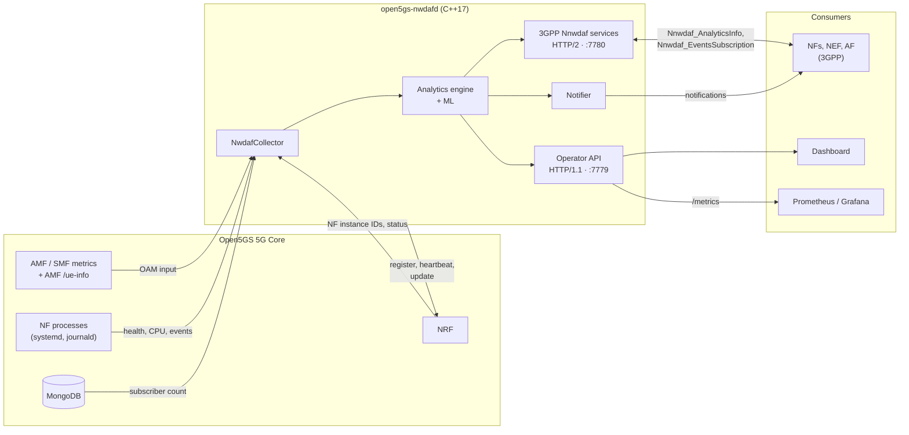

<div align="center">

# 🛰️ Open5GS NWDAF

### Production-grade Network Data Analytics Function for 5G Core — in modern C++

**Standalone NWDAF that runs beside an [Open5GS](https://open5gs.org) core, with no core patches, and serves analytics through the 3GPP Release 18 Nnwdaf services — Release 18 compliant for the supported scope.** NF_LOAD, SLICE_LOAD_LEVEL, NSI_LOAD_LEVEL, NETWORK_PERFORMANCE and UE_MOBILITY over HTTP/2, with predictions, subscriptions, the NRF lifecycle, mTLS and OAuth2; scope and evidence in [`docs/3gpp-rel18-compliance.md`](docs/3gpp-rel18-compliance.md).

[](https://github.com/cem8kaya/open5gs-nwdaf/actions/workflows/ci.yml)
[](LICENSE)
[](https://isocpp.org/)
[-green.svg)](docs/3gpp-rel18-compliance.md)
[](https://portal.3gpp.org/desktopmodules/Specifications/SpecificationDetails.aspx?specificationId=3579)
[](https://portal.3gpp.org/desktopmodules/Specifications/SpecificationDetails.aspx?specificationId=3355)
[](#-open5gs-compatibility)
[](Dockerfile)

[Features](#-features) · [Installation](#-installation) · [Open5GS compatibility](#-open5gs-compatibility) · [Release 18](#-3gpp-release-18-compliance) · [API](#-api) · [Configuration](#%EF%B8%8F-configuration) · [Roadmap](#-roadmap)

</div>

---

## 💡 Why this project?

The **NWDAF (Network Data Analytics Function)** is the intelligence layer of the 5G Core defined by 3GPP, yet no complete, freely available open-source implementation works out of the box with Open5GS. This project fills that gap:

- **No core patches.** It reads what Open5GS already exposes: its metrics, its per-UE list, the NRF, systemd, journald, `/proc`, `/sys` and MongoDB.
- **Standards-first.** The Rel-18 Nnwdaf services (TS 29.520) over HTTP/2, with every request validated against the official 3GPP OpenAPI files, and the TS 29.510 NRF lifecycle. It advertises only what the configured data sources can back.
- **Native, dependency-light ML.** Isolation Forest, EWMA, a Holt trend forecaster and the ITU-T G.107 E-model, in plain C++: no Python runtime.
- **Operable.** Prometheus metrics, a Grafana dashboard, a web UI, a hardened systemd unit, reload without restart, TLS/mTLS and rate limiting.

## ✨ Features

| Capability | Details |
|---|---|
| 🛰️ **3GPP Rel-18 interfaces** | Nnwdaf_AnalyticsInfo and Nnwdaf_EventsSubscription (TS 29.520) over HTTP/2 on port 7780: official-schema validation, supported-features negotiation and the spec's failure semantics. Analytics: **NF_LOAD**, **SLICE_LOAD_LEVEL**, **NSI_LOAD_LEVEL**, **NETWORK_PERFORMANCE** (`NUM_OF_UE` for any area, `SESS_SUCC_RATIO`) and **UE_MOBILITY** (TA and cell per UE) |
| 🔮 **Predictions** | NF_LOAD and NSI_LOAD_LEVEL for a future period, with a confidence (Holt's linear trend over the collected history) |
| 🔔 **Subscriptions** | Subscribe / modify / unsubscribe with PERIODIC, ONE_TIME and THRESHOLD / ON_EVENT_DETECTION reporting and immediate reports; notifications over HTTP/2 |
| 🧭 **NRF integration** | TS 29.510 NFRegister, heartbeat with re-registration, NFUpdate when a reload changes the advertisement, NFDeregister; NF instance IDs and NF status from the NRF |
| 📥 **Data collection** | Open5GS metrics (TS 28.552 measurements per slice), the AMF's per-UE list (`/ue-info`), the NRF, systemd units, journald, `/proc`, `/sys` and MongoDB. What each analytics needs, and where it comes from, is in `/health` |
| 📊 **Operator API** | 10 analytics on `/nwdaf-analytics/v1` for the dashboard and Prometheus, in this project's own format: NF load, UE mobility, UE communication, abnormal behaviour, QoS sustainability, service experience, network performance, SM congestion, redundant transmission, dispersion |
| 🔐 **Security** | TLS and mutual TLS on both listeners, OAuth 2.0 access-token validation on the 3GPP interfaces (TS 33.501), NRF certificate verification, request body and rate limits, a hardened systemd unit and build flags |
| 🔁 **Operations** | `systemctl reload` applies the data-source, capability, window and prediction settings without a restart; a file that fails to validate is refused |
| 📈 **Observability** | Prometheus `/metrics`, a Grafana dashboard, readiness probe, and a `/health` showing source status, the advertised analytics (with what the rest lack) and the Open5GS workarounds in force |
| 🖥️ **Web dashboard** | React + Recharts UI: throughput, anomaly detection, MOS, traffic simulator, subscription management |
| 🧰 **Tools** | `build.sh` (one-command build and install), `nwdaf-cli` (3GPP consumer), `nwdaf-notify-sink`, `nwdaf-fake-oam` (synthetic Open5GS data) and `nwdaf-local` (all of them with the daemon, no core needed) |
| 🧪 **Tested** | 306 Catch2 test cases, including official-schema conformance and HTTP/2 integration; a smoke test with synthetic Open5GS data in CI; a nightly check against a live Open5GS core with UERANSIM UEs |

## 🏗 Architecture



Two surfaces: the **3GPP interfaces** follow the official Rel-18 schemas; the **operator API** is this project's own, for the dashboard and Prometheus.

## 🚀 Installation

**Try it first, without installing anything on a core:**
- [`demo/`](demo/README.md) runs an Open5GS v2.8.0 core, UERANSIM UEs, this NWDAF and the dashboard in one container: `demo/run.sh`, then `docker exec -it nwdaf-demo nwdaf-demo`.
- After a build, `tools/nwdaf-local` runs the NWDAF against synthetic Open5GS data ([Tools](#-tools)).

**Requirements.** Ubuntu 22.04 or newer for the Release 18 build profile (HTTP/2 + TLS, OpenSSL ≥ 3.0); Ubuntu 20.04 builds without TLS. CMake ≥ 3.22, GCC ≤ 15 (the pinned yaml-cpp doesn't build with GCC 16), and network access on the first configure, which downloads the C++ dependencies and the official 3GPP OpenAPI files. CI builds on Ubuntu 22.04 and 20.04.

### 1. Build

```bash
git clone https://github.com/cem8kaya/open5gs-nwdaf.git && cd open5gs-nwdaf
./build.sh --deps --tests        # installs the apt packages, builds the Rel-18 profile, runs the tests
```

`build.sh` profiles: `rel18` (default: HTTP/2 + TLS, the build the Release 18 claim covers), `full` (TLS off, for OpenSSL < 3.0), `minimal` (no journald, TLS or HTTP/2: development only, and it can't register with an Open5GS NRF). `./build.sh --help` lists the options, such as `--openapi-dir` for an offline copy of the 3GPP files.

<details>
<summary>Manual CMake steps</summary>

```bash
sudo apt-get install -y --no-install-recommends build-essential cmake git pkg-config ca-certificates \
    libsqlite3-dev libsystemd-dev libssl-dev libnghttp2-dev libcurl4-openssl-dev
cmake -S . -B build -DCMAKE_BUILD_TYPE=Release -DNWDAF_REQUIRE_REL18_PROFILE=ON
cmake --build build --parallel "$(nproc)"
cd build && ctest --output-on-failure
```
Ubuntu 20.04: add `-DNWDAF_USE_TLS=OFF` and drop `-DNWDAF_REQUIRE_REL18_PROFILE=ON`; it ships CMake 3.16, so install a newer one (`pip3 install "cmake>=3.22,<4"`). CMake 4 needs `-DCMAKE_POLICY_VERSION_MINIMUM=3.5`. The optional MongoDB driver (`libmongoc-dev libmongocxx-dev`) gives the operator API's subscriber count; without it, `mongosh` is used if present.
</details>

### 2. Install

```bash
./build.sh --install
```

This installs the daemon and tools to `/usr/local/bin`, the configuration to `/etc/open5gs/nwdaf.yaml`, the OpenAPI files to `/etc/open5gs/openapi/`, and the systemd unit. The unit runs as `open5gs`, the Open5GS packages' user, with write access only to `/opt/nwdaf` and `/var/log/open5gs`; `build.sh` creates `/opt/nwdaf`, gives it to that user and adds the user to `systemd-journal`, so the NWDAF can read the NFs' journals.

### 3. Configure for Open5GS

Open5GS v2.8.0 serves its metrics, and the AMF's per-UE list, from a `metrics:` block in each NF's YAML; the packaged configuration enables it on loopback (AMF `127.0.0.5:9090`, SMF `127.0.0.4:9090`). Check it from the NWDAF's host:

```bash
curl -s http://127.0.0.5:9090/metrics | grep registeredsubnbr     # AMF: UEs per slice (once UEs register)
curl -s http://127.0.0.4:9090/metrics | grep pdusessioncreation    # SMF: session counters
curl -s http://127.0.0.5:9090/ue-info | jq .pager                  # AMF: the per-UE list
```

Then set, in `/etc/open5gs/nwdaf.yaml` (every setting is explained in the file):

```yaml
  nf_instance_id: "<uuidgen output>"    # once, and keep it
  plmn_mcc: "999"                       # amf.yaml plmn_id
  plmn_mnc: "70"
  open5gs_version: "2.8.0"

  nrf_uri: "http://127.0.0.10:7777"     # nrf.yaml sbi server
  nrf_nf_discovery: true                # NF instance IDs and status    → NF_LOAD

  oam_metrics_endpoints:                # UEs/sessions per slice, session counters
    AMF: "http://127.0.0.5:9090/metrics"
    SMF: "http://127.0.0.4:9090/metrics"
  amf_ue_info_endpoint: "http://127.0.0.5:9090/ue-info"   # UE locations → UE_MOBILITY, NUM_OF_UE per area

  served_tai_list:                      # amf.yaml tai list (unquoted tac = decimal) → SESS_SUCC_RATIO
    - {tac: 1}
  slice_capacity:                       # your admission maxima per S-NSSAI → SLICE / NSI_LOAD_LEVEL
    - snssai: {sst: 1}
      max_ues: 1000
      max_pdu_sessions: 2000
```

Leave out a block and the analytics it enables is simply not advertised. Keep `oauth_enabled: false`: Open5GS issues no tokens. Where the NWDAF must run for each source is in [Open5GS compatibility](#-open5gs-compatibility).

### 4. Start and verify

```bash
sudo systemctl enable --now open5gs-nwdafd
nwdaf-cli health
```

`health` should show every `oamSources` entry `up`, the configured analytics under `rel18Analytics.advertised` (and, for any other, what it lacks), the sources under `dataSources`, and `open5gs.verified: true`. Then, for example:

```bash
nwdaf-cli get NETWORK_PERFORMANCE --nw-perf NUM_OF_UE --tai 999-70-1
nwdaf-cli get UE_MOBILITY --supi imsi-999700000000001
```

After editing the configuration, `sudo systemctl reload open5gs-nwdafd` applies the data-source, capability, window and prediction settings; the rest need a restart ([Configuration](#%EF%B8%8F-configuration)).

### Docker

```bash
docker build -t open5gs-nwdaf .
docker run --rm --network host -v "$PWD/my-nwdaf.yaml:/etc/open5gs/nwdaf.yaml:ro" open5gs-nwdaf
```

The image (Ubuntu 22.04) has the daemon, the default configuration and the OpenAPI files. With the host network it reaches Open5GS's loopback endpoints; otherwise set `sbi_bind_address: "0.0.0.0"`, publish 7779 and 7780, and point the data sources at addresses the container can reach. In a container the NWDAF can't see the host's systemd, journald or `/proc`, so NF_LOAD has no CPU figures (it keeps the NRF status).

## 🔗 Open5GS compatibility

**Verified on Open5GS v2.8.0** (`ppa:open5gs/latest`), with UERANSIM UEs in [`demo/`](demo/). The 3GPP interfaces are the same whatever core the NWDAF runs beside; what the core can feed decides which analytics they serve. Open5GS v2.8.0 has no NF event-exposure services, so the inputs come from what it exposes for operations, an OAM-style input TS 23.288 allows.

**What each analytics needs, and where it comes from with Open5GS:**

| Analytics (3GPP interfaces) | Open5GS source | Configure |
|---|---|---|
| NF_LOAD | NF instance IDs and status from the NRF; CPU from `/proc` | `nrf_nf_discovery` (or `nf_instance_ids`) |
| SLICE_LOAD_LEVEL, NSI_LOAD_LEVEL | UEs and PDU sessions per slice, from the AMF/SMF metrics | `slice_capacity` + `oam_metrics_endpoints` |
| NETWORK_PERFORMANCE `NUM_OF_UE` | UE locations from the AMF's `/ue-info` (any area), or the AMF metrics (the whole served area) | `amf_ue_info_endpoint`, or `served_tai_list` + AMF metrics |
| NETWORK_PERFORMANCE `SESS_SUCC_RATIO` | session setup counters from the SMF metrics | `served_tai_list` + SMF metrics |
| UE_MOBILITY | UE locations from the AMF's `/ue-info` | `amf_ue_info_endpoint` |

**Where the NWDAF must run.** The metrics, `/ue-info`, the NRF and MongoDB are reached over the network. systemd units, `/proc` (NF health and CPU) and journald (operator-API UE events) are local to the NFs' host, and `/sys/class/net/ogstun` (throughput) to the UPF's. On a single-host core, run the NWDAF on that host for everything; on a separate machine, set the NFs' `metrics: server: address` to a reachable IP. The Rel-18 analytics still work then, with NF_LOAD reporting NRF status only.

**Workarounds.** Eight Open5GS behaviours are handled, each with an ID (`O5GS-01`…`O5GS-08`) tagged in the code and a dated interoperability record: the NRF's list format and its hidden NF discovery, heartbeat load the NRF discards, a session-success counter that counts twice, registered-UE counts only per subscribed slice, UPF counters that are compiled out, the non-standard per-UE JSON, and no event exposure or OAuth. They are listed in [`docs/3gpp-rel18-compliance.md`](docs/3gpp-rel18-compliance.md) §9.2. Set `open5gs_version` to your core's version: an unverified one is warned about at startup, and the nightly [interop job](.github/workflows/interop.yml) (`demo/interop-check.sh`) checks the workarounds against a live core.

**What Open5GS v2.8.0 can't provide**, so these aren't offered on the 3GPP interfaces:
- per-UE traffic (the UPF's counters are compiled out; PFCP reports only downlink volume per 100 MiB): UE_COMMUNICATION, DISPERSION by volume;
- AF service data: SERVICE_EXPERIENCE;
- SM congestion control: SM_CONGESTION;
- OAuth 2.0 tokens: keep `oauth_enabled` off;
- `nwdafInfo` in the NRF: consumers can't discover the NWDAF by analytics there.

The operator API still serves its own forms of those analytics from the scraped data.

## 📐 3GPP Release 18 compliance

The frozen baseline is [`docs/frozen-standards.md`](docs/frozen-standards.md) (TS 23.288 V18.13.0, TS 29.520 V18.14.0, the official OpenAPI files at a pinned commit), and the tracker with every interpretation and its evidence is [`docs/3gpp-rel18-compliance.md`](docs/3gpp-rel18-compliance.md). Milestone **M1 passed** (2026-09-28): the NWDAF is **Release 18 compliant for the supported scope** in the `rel18` build profile (HTTP/2 + TLS). The claim covers the NWDAF's own interfaces: the Nnwdaf services, the NRF interaction and security. Which analytics they serve depends on the core's inputs ([above](#-open5gs-compatibility)).

| Analytics ID | TS 23.288 | 3GPP interfaces (Rel-18 form) | Operator API |
|---|---|---|---|
| `NF_LOAD` | §6.5 | ✅ CPU and NRF status per NF instance; predictions | ✅ EWMA load |
| `SLICE_LOAD_LEVEL` | §6.3 | ✅ occupancy of `slice_capacity` (I-9) | — |
| `NSI_LOAD_LEVEL` | §6.3 | ✅ per S-NSSAI (I-9); predictions | — |
| `NETWORK_PERFORMANCE` | §6.6 | ✅ `NUM_OF_UE`, `SESS_SUCC_RATIO` (I-11) | ✅ composite score |
| `UE_MOBILITY` | §6.7.2 | ✅ TA and cell stays per SUPI (I-12) | ✅ from journald |
| `UE_COMMUNICATION` | §6.7.3 | ⬜ no per-UE traffic | ✅ |
| `ABNORMAL_BEHAVIOUR` | §6.7.5 | ⬜ | ✅ Isolation Forest |
| `SERVICE_EXPERIENCE` | §6.4 | ⬜ no AF data | ✅ E-model MOS |
| `QOS_SUSTAINABILITY` | §6.9 | ⬜ | ✅ trend |
| `SM_CONGESTION` | §6.12 | ⬜ no SM congestion control | ✅ failure ratio |
| `RED_TRANS_EXP` | §6.13 | ⬜ | ✅ rate stability |
| `DISPERSION` | §6.10 | ⬜ | ✅ concentration |

The 3GPP forms are advertised only when configured (`rel18Analytics` in `/health` says what is missing). `I-n` are the interpretations pinned in the compliance doc's Appendix A. The operator API's forms report what the scraped data can observe and name what they can't see in a `note`. IDs use the Rel-18 `NwdafEvent` spelling; the operator API also accepts `QoS_SUSTAINABILITY` and `REDUNDANT_TRANSMISSION`.

## 🔌 API

### 3GPP interfaces — HTTP/2, port 7780

TS 29.520 V18.14.0; every request is validated against the official OpenAPI files.

| Method | Path | Operation |
|---|---|---|
| `GET` | `/nnwdaf-analyticsinfo/v1/analytics?event-id=…&tgt-ue=…&event-filter=…&ana-req=…` | Nnwdaf_AnalyticsInfo. A future `startTs`/`endTs` in `ana-req` asks for a prediction. Slice load level is `event-id=LOAD_LEVEL_INFORMATION` |
| `POST` | `/nnwdaf-eventssubscription/v1/subscriptions` | Subscribe: `201` + `Location`, with immediate reports when `immRep` is set |
| `PUT` / `DELETE` | `/nnwdaf-eventssubscription/v1/subscriptions/{subscriptionId}` | Modify / Unsubscribe |

Served as h2c with prior knowledge, or h2 over TLS. Notifications are `NnwdafEventsSubscriptionNotification` bodies over HTTP/2 with `3gpp-Sbi-Callback: Nnwdaf_EventsSubscription_Notify`. The same resources are also answered over HTTP/1.1 on port 7779, for development. Query parameters are JSON-encoded, which [`nwdaf-cli`](#-tools) does for you:

```bash
curl --http2-prior-knowledge "http://127.0.0.1:7780/nnwdaf-analyticsinfo/v1/analytics?event-id=NF_LOAD&tgt-ue=%7B%22anyUe%22%3Atrue%7D"
```

### Operator API — HTTP/1.1, port 7779

| Method | Path | Description |
|---|---|---|
| `GET` | `/nwdaf-analytics/v1/health` | Liveness, plus the transport profile, metrics-source status (`oamSources`), the advertised Rel-18 analytics and what the rest lack (`rel18Analytics`), each input's source (`dataSources`) and the Open5GS workarounds (`open5gs`) |
| `GET` | `/nwdaf-analytics/v1/ready` | Readiness (`READY` once the ML models are fitted, `503` before) |
| `GET` | `/nwdaf-analytics/v1/metrics` | Prometheus metrics |
| `GET` | `/nwdaf-analytics/v1/openapi` | This API's OpenAPI 3.0 contract |
| `GET` | `/nwdaf-analytics/v1/analytics?analyticsId=<ID>` | One of the operator API's 10 analytics |
| `POST` / `GET` | `/nwdaf-analytics/v1/subscriptions` | Create / list subscriptions (push to `notifUri`) |
| `GET` / `DELETE` | `/nwdaf-analytics/v1/subscriptions/{subId}` | Get / delete a subscription |
| `POST` | `/nwdaf-analytics/v1/train` | Retrain the Isolation Forest |
| `POST` | `/nnwdaf-analyticsinfo/v1/analytics` | Deprecated JSON-body analytics request; non-standard (TS 29.520 defines a `GET`) |

```bash
curl "http://127.0.0.1:7779/nwdaf-analytics/v1/analytics?analyticsId=ABNORMAL_BEHAVIOUR"
curl -X POST "http://127.0.0.1:7779/nwdaf-analytics/v1/subscriptions" -H "Content-Type: application/json" \
     -d '{"analyticsId": "NF_LOAD", "notifUri": "http://consumer:8080/notify"}'
```

The operator API's contract is [`docs/openapi/nwdaf-analytics-v1.yaml`](docs/openapi/nwdaf-analytics-v1.yaml), also served at `/nwdaf-analytics/v1/openapi`; `tests/test_openapi_conformance.cpp` validates every live response against it. The 3GPP interfaces follow the official 3GPP OpenAPI files instead, which are authoritative.

## 🧰 Tools

| Tool | What it does |
|---|---|
| `build.sh` | Build, test and install in one command ([Installation](#-installation)) |
| `tools/nwdaf-local` | Runs the NWDAF with synthetic Open5GS data and a notification sink (`config/nwdaf-local.yaml`); `--check` runs smoke checks, as CI does |
| `nwdaf-cli` | A 3GPP consumer: builds the JSON-encoded queries and subscription bodies from short options and sends them over HTTP/2. `nwdaf-cli health` summarises `/health`. Needs `curl` and `jq` |
| `nwdaf-notify-sink` | Prints the notifications it receives (h2c, and HTTP/1.1 with `--http1-port`) and answers `204` |
| `nwdaf-fake-oam` | Synthetic Open5GS AMF/SMF metrics and `/ue-info`, with UEs moving between `--area` locations; change it live with `curl '…/set?ues=8'` |

```bash
tools/nwdaf-local                       # Ctrl-C stops everything
nwdaf-cli get SLICE_LOAD_LEVEL --any-slice
nwdaf-cli subscribe SLICE_LOAD_LEVEL --snssai 1 --threshold 60 --notify http://127.0.0.1:9999/n
curl 'http://127.0.0.1:9090/set?ues=9'  # crosses 60 %: the sink prints the report
```

`cmake --install` puts `nwdaf-cli`, `nwdaf-notify-sink` and `nwdaf-fake-oam` in `/usr/local/bin`.

## ⚙️ Configuration

Everything deployment-specific is in [`config/nwdaf.yaml`](config/nwdaf.yaml), which explains each setting. **R** marks those `systemctl reload open5gs-nwdafd` (SIGHUP) applies; the others need a restart. When a reload changes the advertised analytics or served TAIs, the NWDAF sends the new profile to the NRF (NFUpdate). A file that fails to validate is refused and the running configuration kept.

**Identity and listeners**

| Parameter | Default | R | Description |
|---|---|---|---|
| `nf_instance_id` | — | | **Mandatory.** This NWDAF's NF instance ID (UUID); keep it stable |
| `plmn_mcc` / `plmn_mnc` | `999` / `70` | | The core's PLMN |
| `open5gs_version` | `2.8.0` | | The core's Open5GS version; another than the verified 2.8.0 is warned about |
| `sbi_bind_address` | `127.0.0.1` | | Address both listeners bind to |
| `sbi_port` | `7779` | | Operator API and dashboard, HTTP/1.1 (not 7777: Open5GS uses it) |
| `sbi_h2_port` | `7780` | | The 3GPP interfaces over HTTP/2, registered with the NRF. `0` = off: HTTP/1.1 only, not Rel-18 compliant |

**NRF**

| Parameter | Default | R | Description |
|---|---|---|---|
| `nrf_uri` | `http://127.0.0.10:7777` | | The NRF (Open5GS's needs HTTP/2) |
| `nrf_register_on_startup` | `true` | | NFRegister at start, NFDeregister at stop |
| `nrf_heartbeat_interval_seconds` | `60` | | Heartbeat period, unless the NRF assigns one; `0` = none |
| `nrf_nf_discovery` | `false` | | Poll the NRF (NFListRetrieval, NFProfileRetrieval) for NF instance IDs, where exactly one instance of a type is registered, and NF status. Enables NF_LOAD |
| `nrf_nf_discovery_interval_seconds` | `60` | | Poll period |
| `nrf_nf_status_window_seconds` | `3600` | | Period the NF_LOAD `nfStatus` percentages cover |

**Data sources**

| Parameter | Default | R | Description |
|---|---|---|---|
| `oam_metrics_endpoints` | — | R | NF type → its Prometheus metrics URL (Open5GS v2.8.0: AMF `http://127.0.0.5:9090/metrics`, SMF `…127.0.0.4…`, UPF `…127.0.0.7…`, PCF `…127.0.0.13…`) |
| `amf_ue_info_endpoint` | — | R | The AMF's per-UE list (`http://127.0.0.5:9090/ue-info`): UE locations. It lists SUPIs without authentication, so keep the metrics port internal |
| `nf_service_names` | `AMF→amfd`, … | | NF type → systemd unit suffix (`open5gs-<name>`), for NF health and CPU |
| `throughput_interfaces` | `ogstun` | | UPF tunnel interfaces whose `/sys` counters give throughput |
| `collection_interval_seconds` | `10` | R | Sampling period of every source |
| `throughput_history_size` | `360` | | Samples kept per series |
| `amf_journal_lines` / `smf_journal_lines` | `500` | | journald lines read per tick |
| `supi_regex` | `imsi-(\d{15})` | | Extracts the SUPI from Open5GS log lines |
| `mongodb_uri` / `mongodb_db` | `mongodb://127.0.0.1:27017` / `open5gs` | | Subscriber database (operator-API subscriber count) |

**Rel-18 analytics capability**

| Parameter | Default | R | Description |
|---|---|---|---|
| `nf_instance_ids` | — | R | NF type → its NRF `nfInstanceId`; enables NF_LOAD without NRF polling, and wins over it |
| `slice_capacity` | — | R | Per S-NSSAI (`snssai: {sst, sd}`) `max_ues` and/or `max_pdu_sessions`, as an NSACF would hold them. Slice and NSI load level are the higher occupancy in percent (I-9); `max_ues` needs the AMF metrics, `max_pdu_sessions` the SMF's |
| `served_tai_list` | — | R | The TAIs the core serves (amf.yaml `tai`): `{tac}` with optional `mcc`/`mnc`; an unquoted `tac` is decimal, a quoted 4- or 6-digit one hex. The metrics-based NETWORK_PERFORMANCE types describe this whole area (I-11) |
| `slice_load_window_seconds` | `300` | R | Slice and NSI load statistics period when a request gives none |
| `network_performance_window_seconds` | `300` | R | NETWORK_PERFORMANCE statistics period when a request gives none |
| `ue_mobility_window_seconds` | `3600` | R | UE_MOBILITY statistics period when a request gives none |
| `ue_location_history_seconds` | `86400` | | How long UE locations are kept, in memory only |
| `prediction_horizon_seconds` | `900` | R | How far ahead a predicted period may end (I-13); `0` = no predictions |
| `prediction_min_samples` | `10` | R | Fewer samples give a prediction with confidence 0 |
| `prediction_tolerance` | `10` | R | Error, in percentage points, a prediction's confidence counts as correct |

**ML (operator API)**

| Parameter | Default | R | Description |
|---|---|---|---|
| `model_dir` | `/opt/nwdaf/models` | | Where the anomaly model is saved |
| `anomaly_contamination` | `0.10` | R | Expected share of anomalies (Isolation Forest) |
| `anomaly_seed` | `0` | | Model seed; `0` = random |
| `anomaly_min_samples` | `120` | | Samples needed before training |
| `baseline_stddev_min_kbps` | `0.5` | | Below this throughput spread, ABNORMAL_BEHAVIOUR reports `BASELINE_TOO_LOW` |
| `ewma_alpha` | `0.3` | R | EWMA smoothing, also the forecaster's level smoothing |
| `network_performance_weights` | `0.6` / `0.2` / `0.2` | | Operator-API network performance score weights (NF health, downlink, PDU sessions), summing to 1.0 |

**Logging, persistence, security and API documents**

| Parameter | Default | R | Description |
|---|---|---|---|
| `log_level` | `info` | R | `trace`, `debug`, `info`, `warn` or `error` |
| `log_file` | `/var/log/open5gs/nwdaf.log` | | Log file, besides the console |
| `history_backend` / `history_db_path` | `sqlite` / `/opt/nwdaf/history.db` | | `sqlite` keeps history and subscriptions across restarts; `none` = memory only |
| `tls_enabled` + `tls_cert_file` / `tls_key_file` | `false` | | TLS on both listeners (a TLS build) |
| `tls_ca_file` | — | | When set: mutual TLS, clients need a certificate from this CA; the NRF is verified against it too |
| `oauth_enabled` + `oauth_nrf_public_key_file` / `oauth_shared_secret_file` | `false` | | OAuth 2.0 access tokens on the 3GPP interfaces (TS 33.501 §13.4.1), checked against the NRF's public key (RS256/ES256) or a shared secret (HS256). Keep it off with Open5GS |
| `rate_limit_per_ip_rps` / `rate_limit_global_rps` | `10` / `100` | | Request rate limits; `0` = none |
| `openapi_spec_path` | `/etc/open5gs/openapi/nwdaf-analytics-v1.yaml` | | The operator-API contract served at `/openapi` |
| `openapi_3gpp_dir` | `/etc/open5gs/openapi/3gpp` | | The official 3GPP OpenAPI files requests are validated against; without them the 3GPP interfaces answer `500` (from a build tree: `build/3gpp-openapi`) |

### Build options

| CMake option | Default | Description |
|---|---|---|
| `NWDAF_USE_HTTP2` | `ON` | HTTP/2 for the 3GPP interfaces and the NRF (nghttp2, libcurl). `OFF`: HTTP/1.1 only, not Rel-18 compliant, and the Open5GS NRF refuses it |
| `NWDAF_USE_TLS` | `ON` | TLS (OpenSSL ≥ 3.0) and OAuth 2.0 |
| `NWDAF_REQUIRE_REL18_PROFILE` | `OFF` | Fail the configure unless HTTP/2 and TLS are both on (`build.sh` sets it for `rel18`) |
| `NWDAF_USE_SD_JOURNAL` | `ON` | journald collection and `sd_notify` |
| `NWDAF_ENABLE_PUSH_DELIVERY` | `ON` | Subscription notifications |
| `NWDAF_BUILD_TESTS` | `ON` | The Catch2 tests |
| `NWDAF_3GPP_OPENAPI_SOURCE_DIR` | — | An offline copy of the 3GPP OpenAPI files (hash-checked) |

Without SQLite, history stays in memory; without a MongoDB driver or `mongosh`, the subscriber count is 0.

## 📊 Dashboard & observability

- **Web UI** ([`dashboard/`](dashboard/)): a React + Recharts single-page app (throughput, NF health, anomalies, QoS, MOS, network performance score, subscriptions, a traffic simulator), served by nginx with `/nwdaf-analytics/` proxied to port 7779. It shows the operator API's analytics.
- **Grafana** ([`grafana/nwdaf_dashboard.json`](grafana/nwdaf_dashboard.json)): an import-ready dashboard on the Prometheus `/metrics` endpoint.

## 🧠 ML internals

| Model | Used by | Implementation |
|---|---|---|
| Isolation Forest | `ABNORMAL_BEHAVIOUR` (operator API) | Native C++, configurable contamination and seed, quality-gated retraining, atomic model persistence |
| EWMA predictor | `NF_LOAD` (operator API) | Exponentially weighted moving average, configurable α |
| Holt linear-trend forecaster | NF_LOAD and NSI_LOAD_LEVEL predictions (3GPP) | Level and trend smoothing; the confidence is the probability of an error within `prediction_tolerance` (I-13) |
| E-model MOS estimator | `SERVICE_EXPERIENCE` (operator API) | ITU-T G.107: `R = R0 − Id − Ie_eff` with throughput, packet-loss and delay terms, and a per-impairment breakdown |

No Python runtime and no external ML framework: inference runs in the daemon.

## 🧪 Testing

```bash
./build.sh --tests                       # or: cd build && ctest --output-on-failure
./build/tests/nwdaf_tests "H1.4:*"       # one group, by Catch2 name filter
```

306 Catch2 test cases in two binaries: `nwdaf_tests` (unit, parallel) and `nwdaf_integration_tests` (a real server on port 17779, HTTP/2 included). A mock Open5GS collector and a mock NRF stand in for the core.

| Suites | Cover |
|---|---|
| `test_3gpp_sbi`, `test_schema_validator`, `test_supported_features` | The Rel-18 interfaces over HTTP/2: official-schema validation, failure semantics, features, subscriptions, notifications |
| `test_slice_load`, `test_network_performance`, `test_ue_mobility`, `test_predictions`, `test_threshold_reporting` | The Rel-18 analytics (I-9 to I-13), against the official schemas |
| `test_nrf_client`, `test_sbi_security`, `test_oauth` | NRF lifecycle, mTLS, OAuth 2.0 |
| `test_compat`, `test_config_reload`, `test_analytics_catalogue`, `test_compliance_doc` | Inputs and advertisement, the Open5GS workarounds, reload, the compliance tracker's evidence |
| `test_collector`, `test_oam_metrics`, `test_analytics`, `test_h1_analytics`, `test_server_integration`, `test_openapi_conformance`, `test_arch_improvements` | Collection, the operator API and its contract, persistence |

CI ([`ci.yml`](.github/workflows/ci.yml)) builds and tests on Ubuntu 22.04 and 20.04, runs `tools/nwdaf-local --check`, and builds the Docker image. The [interop job](.github/workflows/interop.yml) runs nightly against a live Open5GS core with UERANSIM UEs.

## 🗺 Roadmap

Tracked in [`docs/ENHANCEMENT_PLAN_5G_6G.md`](docs/ENHANCEMENT_PLAN_5G_6G.md) and on the [project board](https://github.com/users/cem8kaya/projects/5).

**Horizon 1 — Rel-17/18 completeness & data-path realism** ([#20](https://github.com/cem8kaya/open5gs-nwdaf/issues/20))

- [x] H1.7–H1.10 — Rel-18 Nnwdaf interfaces, HTTP/2, NRF lifecycle, mTLS and OAuth2; **M1** passed 2026-09-28
- [x] Rel-18 analytics: NF_LOAD, SLICE_LOAD_LEVEL, NSI_LOAD_LEVEL, NETWORK_PERFORMANCE, UE_MOBILITY; THRESHOLD reporting; predictions
- [x] Open5GS data sources: metrics (OAM input) and the per-UE list; inputs-based advertisement; registered workarounds and a nightly interop check
- [x] `DISPERSION`, `SM_CONGESTION`, `RED_TRANS_EXP`, the E-model MOS and the operator API's OpenAPI contract ([#26](https://github.com/cem8kaya/open5gs-nwdaf/issues/26)–[#28](https://github.com/cem8kaya/open5gs-nwdaf/issues/28))
- [ ] A standard data-source backend (Nnf_EventExposure, TS 28.532 OAM) for other cores ([#23](https://github.com/cem8kaya/open5gs-nwdaf/issues/23))
- [ ] Per-slice anomaly models ([#24](https://github.com/cem8kaya/open5gs-nwdaf/issues/24))
- [ ] Per-UE / per-session data via PFCP usage reporting ([#25](https://github.com/cem8kaya/open5gs-nwdaf/issues/25); on hold: Open5GS reports downlink volume per 100 MiB only)
- [ ] `DN_PERFORMANCE`, `USER_DATA_CONGESTION` — blocked on per-UE and AF inputs

**Horizon 2 — Data & ML platform maturity** ([#21](https://github.com/cem8kaya/open5gs-nwdaf/issues/21)): MTLF/AnLF split, model registry, drift detection, seasonal forecasting (Holt-Winters), ADRF / data lake, evaluation harness with calibrated confidence, anomaly attribution ([#29](https://github.com/cem8kaya/open5gs-nwdaf/issues/29)–[#35](https://github.com/cem8kaya/open5gs-nwdaf/issues/35)).

**Horizon 3 — 5G-Advanced → 6G readiness** ([#22](https://github.com/cem8kaya/open5gs-nwdaf/issues/22)): closed-loop automation and intent, energy-efficiency analytics, federated learning, network digital twin, ISAC data types, Helm and horizontal scaling ([#36](https://github.com/cem8kaya/open5gs-nwdaf/issues/36)–[#41](https://github.com/cem8kaya/open5gs-nwdaf/issues/41)).

## 🤝 Contributing

Contributions are very welcome — this project aims to become the reference open-source NWDAF for the Open5GS ecosystem.

1. Fork the repo and create a feature branch
2. Build with tests: `./build.sh --tests`
3. Make sure `ctest` passes and the build stays warning-clean (`-Wall -Wextra -Werror`)
4. Open a PR with a clear description; reference the relevant 3GPP clause when touching spec-defined behaviour

Bug reports, spec-compliance findings, and lab test reports (please include your Open5GS version and topology) are as valuable as code.

## 📄 License

Licensed under the [Apache License 2.0](LICENSE) — free for commercial and non-commercial use.

## 🙏 Acknowledgements

- [Open5GS](https://github.com/open5gs/open5gs) — the open-source 5G core this project is built to serve
- [cpp-httplib](https://github.com/yhirose/cpp-httplib), [nlohmann/json](https://github.com/nlohmann/json), [yaml-cpp](https://github.com/jbeder/yaml-cpp), [spdlog](https://github.com/gabime/spdlog), [Catch2](https://github.com/catchorg/Catch2)
- 3GPP SA2/CT3 for the NWDAF specification family

---

<div align="center">

**⭐ If this project is useful to you, please star it — it directly helps the 5G open-source ecosystem grow.**

[Report a bug](https://github.com/cem8kaya/open5gs-nwdaf/issues) · [Request a feature](https://github.com/cem8kaya/open5gs-nwdaf/issues) · [Discussions](https://github.com/cem8kaya/open5gs-nwdaf/discussions)

</div>
